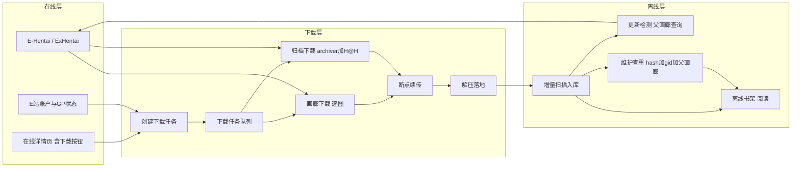

# 在线 → 下载 → 离线 双系统完整方案

> 目标：打通「E 站在线详情 → 下载（画廊/归档）→ 解压落地 → 离线扫描入库 → 更新/维护」全链路。
> 本文档用于敲定整体架构与分步实施计划，供实现阶段（Code 模式）执行。

---

## 一、总体数据流



---

## 二、术语与文件约定

E-Hentai 下载生态中，下载产物需要携带三类元数据，离线层据此还原元数据并入库：

| 文件                         | 来源模式                 | 作用                                                                                                                                 | 现有解析                                                                            |
| ---------------------------- | ------------------------ | ------------------------------------------------------------------------------------------------------------------------------------ | ----------------------------------------------------------------------------------- |
| `metadata`（JSON 无扩展名）  | 画廊下载（散图文件夹）   | 画廊完整元数据：gid / token / parent_gid / title / title_jpn / category / uploader / filecount / filesize / expunged / rating / tags | [`metadata.go`](../backend/internal/services/metadata.go:26) 已部分解析，需扩展字段 |
| `ametadata`（JSON 无扩展名） | 归档下载（压缩包内或旁） | 归档元数据，字段与 metadata 一致                                                                                                     | 同上                                                                                |
| `ComicInfo.xml`              | 两种模式都带             | 标准漫画元数据（Title / Series / Writer / Genre / Tags…）                                                                            | [`metadata.go`](../backend/internal/services/metadata.go:14) 已解析                 |

**落地目录约定**（对应下载设置里的两个路径）：

- 压缩包路径 `archivePath`：归档下载的 `.zip/.cbz` 存放地
- 解压后的文件夹存储路径 `extractPath`：散图文件夹（画廊下载直接写这里；归档解压到这里）
- 文件夹命名约定（本子名取 title，需清理非法字符 `\ / : * ? " < > |` 与首尾空格、超长截断）：
  - 普通画廊下载：`gid - 本子名`
  - 归档画廊下载：`archive - gid - 本子名`（zip 与解压文件夹同名，仅扩展名不同）
- gid 前缀保证查重与更新关联；token 存于 metadata/ametadata 内，无需进目录名

---

## 三、模块分解与职责

### 1. 在线层（前端 + 后端薄接口）

**前端 [`OnlineDetail.vue`](../src/views/online/OnlineDetail.vue)**

- 顶栏新增「⬇️ 下载」按钮，点击弹出下载确认面板
- 面板内容：
  - 模式选择：普通画廊下载 / 归档下载（radio）
  - 归档下载再选：原图 / 压缩图（radio）
  - GP 信息：当前余额 + 本画廊预估消耗（从后端返回）
  - 确认 → 调用 `POST /api/v1/downloads` 创建任务
- 若该画廊已在下载/已完成，按钮显示对应状态（下载中/已下载），可跳转下载列表

**后端新增接口**

- `GET /api/v1/downloads/gp-info?gid=...&token=...`：实时抓取 `archiver.php?gid=..&token=..`，返回原图/压缩图两方案的真实 `Download Cost` + `Estimated Size`（不做 filesize 估算）；画廊模式附带「会消耗 Credits/GP」文字提示（见五.5.1）
- `POST /api/v1/downloads`：创建下载任务
- `GET /api/v1/downloads`：任务列表（下载中/故障/全部）
- `GET /api/v1/downloads/:id`：单个任务进度
- `POST /api/v1/downloads/:id/pause | resume | cancel | retry`
- `POST /api/v1/downloads/:id/unlock`：GP 配额解锁后重试
- `POST /api/v1/downloads/restore`：扫描 archivePath/extractPath 恢复历史任务

### 2. 下载层（后端核心）

**新文件 `backend/internal/services/download.go`**

- **任务模型** `models.DownloadTask`（见第四节数据模型）
- **任务队列**：内存队列（goroutine worker 池）+ SQLite 持久化任务记录，后端重启可恢复
- **画廊下载引擎**
  1. `FetchOnlinePageUrls`（[`eh_reader.go`](../backend/internal/services/eh_reader.go:40) 已有，gdata 主方案 + 逐页兜底）
  2. 按「同时下载图片数量」并发下载原图到 `extractPath/gid - 本子名/`
  3. 完成后写入 `metadata` + `ComicInfo.xml` 到同文件夹
- **归档下载引擎**
  1. 抓取 `archiver.php?gid=..&token=..&or=..` 解析归档下载页
  2. 按「原图/压缩图」选 archive key（download original / resample）
  3. 从 H@H 服务器下载 zip → `archivePath/`；包内天然含 `ametadata` + `ComicInfo.xml`（若无则补充写入）
- **并发与限速**：读下载设置（同时下载图片数量、速度限制）
- **断点续传**
  - 图片模式：记录已下载页集合 + 字节；重启后跳过已完成页
  - 归档模式：`HTTP Range` 续传 + 本地 `.part` 文件
- **GP 配额识别**：下载中被限流/配额不足 → 状态置为 `error_lock`，前端显示「需要配额/GP 解锁」

**新文件 `backend/internal/services/extract.go`**

- 归档完成后解压到 `extractPath`（保留 metadata/ametadata/comicinfo）
- 按 `deleteZipAfterArchiveDownload` 设置决定是否删除原压缩包
- 解压进度回写任务状态

### 3. 离线层（后端 + 前端）

**扫描入库增强 [`scanner.go`](../backend/internal/services/scanner.go:20)**

- 复用现有 `ScanAndSaveDirectory` + [`ParseDirMetadata`](../backend/internal/services/metadata.go:43) / `ParseZipMetadata`
- 新增**增量扫描**：按 mtime + 文件大小 + gid 判断是否需要重扫（默认增量；全量由用户触发）
- 入库时读取 gid/token/parent_gid 写入 `OfflineComic` 扩展字段，实现 gid 查重（重复跳过）

**更新检测（父画廊查询）`backend/internal/services/update.go`**

- 遍历离线库中有 gid 的条目，通过详情页解析父画廊链接（`Parent gallery`）
- 对比 filecount / title / posted 时间，检测到新版本 → 仅标记 `NeedsUpdate` + 提示
- 前端 [`OfflineUpdate.vue`](../src/views/offline/OfflineUpdate.vue) 由 mock 改为真实列表，支持「手动选择下载新版本」
- 新版本下载完成后**不自动替换**旧版本；替换/删除留给维护（[`OfflineMaintain.vue`](../src/views/offline/OfflineMaintain.vue) 提示 + 手动选择删除）
- 「自动更新画廊」设置（并入 DownloadSettings 新增分组）：开启后检测到新版本自动按所选方案下载；无 H@H 时可自动降级为画廊下载；下载完成后是否自动删除旧版本文件夹（原件）；归档 zip 是否删除独立遵循 `deleteZipAfterArchiveDownload` 设置

**维护查重 `backend/internal/services/dedup.go`**

- 三种维度：文件 hash（完全相同）、gid（同画廊不同来源）、父画廊（同一作品多版本）
- 前端 [`OfflineMaintain.vue`](../src/views/offline/OfflineMaintain.vue) 由 mock 改为真实分组列表，支持「仅保留 A / B」

### 4. 前端下载列表 [`DownloadsView.vue`](../src/views/DownloadsView.vue)

- 由 mock 改为轮询 `GET /api/v1/downloads`（只显示 downloading / error / error_lock / paused，completed 移入离线书架）
- 标签页区分：画廊下载 / 归档下载
- 每项：封面、标题、进度条、速度、状态标签
- 操作：暂停 / 恢复 / 取消 / 重试 / 🔒 解锁（error_lock）
- 恢复下载任务：调用 `POST /api/v1/downloads/restore`

---

## 四、数据模型设计

**新增 `models.DownloadTask`**

```go
type DownloadTask struct {
    ID          string    `gorm:"primaryKey" json:"id"`       // UUID
    GID         string    `gorm:"index" json:"gid"`
    Token       string    `json:"token"`
    Title       string    `json:"title"`
    Mode        string    `json:"mode"`        // gallery | archive
    ArchiveType string    `json:"archiveType"` // original | resample（仅归档）
    Status      string    `json:"status"`      // queued | downloading | paused | completed | error | error_lock | cancelled
    Priority    int       `gorm:"default:0" json:"priority"`
    Group       string    `json:"group"`       // 默认分组（下载/归档）
    TotalFiles  int       `json:"totalFiles"`
    DoneFiles   int       `json:"doneFiles"`
    TotalBytes  int64     `json:"totalBytes"`
    DoneBytes   int64     `json:"doneBytes"`
    Speed       float64   `json:"speed"`       // 字节/秒
    ArchivePath string    `json:"archivePath"` // 压缩包路径
    ExtractPath string    `json:"extractPath"` // 解压后文件夹路径
    Error       string    `json:"error,omitempty"`
    CreatedAt   time.Time `json:"createdAt"`
    UpdatedAt   time.Time `json:"updatedAt"`
}
```

**扩展 `models.OfflineComic`**（支持更新/查重）

- 增加：`GID`、`Token`、`ParentGID`、`FileHash`（可选）、`SourceMode`（gallery/archive）

**扩展 [`EHMetadataJSON`](../backend/internal/services/metadata.go:26)**

- 增加：`gid`、`token`、`parent_gid`、`filecount`、`filesize`、`expunged`（现有 title/title_jpn/category/uploader/rating/tags 保留）

**前端新增 `src/types/download.ts`**

- `DownloadTask`、`DownloadMode`、`ArchiveType`、`GPInfo`（balance + estimate）
- 新增 `src/stores/downloadStore.ts`（轮询任务列表 + 操作）

**注册模型**：`db.go` 的 `AutoMigrate` 增加 `&models.DownloadTask{}`

---

## 五、关键机制细节

### 5.1 GP 消耗与解锁

- **余额来源**：现有 `GET /api/v1/eh/status`（`GetEHUserStatus`）已返回用户 GP/Credits/Hath/H@H
- **直接查询 archiver.php（不做估算）**：`GET https://e-hentai.org/archiver.php?gid=..&token=..` 一次返回两个方案的真实数据：
  - 原图：`Download Cost` + `Estimated Size`
  - 压缩图：`Download Cost` + `Estimated Size`
  - 有 H@H 时显示 `Free`
- GP 面板直接展示上述真实数据（归档模式精确）
- **画廊模式（逐图原图）展示策略**：面板显示「会消耗 Credits/GP」文字提示（逐图按页计费，受等级与 Hath 加成影响；与 archiver 报价不同源，不做精确计算）——用户表示换 IP 可缓解配额，故仅提示即可
- **解锁（error_lock）**：配额不足/限流 → 状态 `error_lock`；重试前重新拉 `/eh/status` 校验余额/H@H 是否恢复

### 5.2 反爬虫与网络层（在现有基础上补充）

现有 [`eh_auth.go`](../backend/internal/services/eh_auth.go:56) 已实现 Cookie jar、igneous 自动抓取、UA/Referer 伪装、代理。下载场景需补充：

1. **图片下载 Referer**：必须带正确 Referer（原图所在域），否则 E 站图床返回 403
2. **全局单例 HTTP Client**：下载是高频率复用，建议进程级共享 client 与 cookie jar（现有每次 `BuildClient` 新建 jar，会导致 igneous 抖动）
3. **速率控制**：严格按「同时下载图片数量」并发 + 「速度限制」节流；E 站对高频图片访问会临时限流
4. **退避重试**：403 / 429 / 临时封禁（`sadpanda` / banned 页面）→ 指数退避后重试，多次失败置 `error` 并记录原因
5. **归档下载**：`archiver.php` 需先 GET 拿表单参数，再 POST 提交；下载走 H@H 服务器（URL 带 archive key），同样带正确 Referer 与 Range
6. **断点续传**：图片服务器一般支持 `Range`；归档（H@H）支持 `Range`，用 `.part` + `Content-Range` 记录偏移
7. **持久化 Cookie**：下载跨进程重启时保留 cookie，避免重登（对应「自动恢复下载任务」）

### 5.3 增量扫描

- 增量：遍历目录，比较 `mtime` / `size`，仅重扫变化项；已入库且 gid 未变 → 跳过
- 全量：用户手动触发（对应 `OfflineMaintain` 的「重新全盘扫描」）
- 复用现有 `scan-paths` 模型，把 `extractPath` 作为默认扫描根

### 5.4 GIF 支持结论

**Go 后端对 GIF 是二进制透明处理的，无需担心。**

- 下载：GIF 与 PNG/JPG 一样是普通文件，`io` 流式写入即可
- 解压：`archive/zip` 二进制透明
- 展示：浏览器 `` 原生支持 GIF 动画；[`reader.go`](../backend/internal/services/reader.go:147) 的 `getContentType` 已映射 `.gif → image/gif`
- 唯一注意点：动画 GIF 体积通常较大（更耗 GP）；Zip 内文件名非 ASCII（日文）时需处理编码（`golang.org/x/text/encoding/japanese`），但这与 GIF 本身无关

---

## 六、分步实施计划（todo 蓝图）

按依赖顺序拆分，每步可独立交付与验证：

1. **后端：数据模型 + 下载任务 CRUD API**（DownloadTask 表、增删改查、暂停/恢复/取消/解锁、GP 信息接口）
2. **后端：画廊下载引擎**（gdata 拉取 URL → 并发逐图下载 → 写 metadata + ComicInfo.xml → 断点续传）
3. **后端：归档下载引擎**（archiver.php → H@H 下载 → 原图/压缩图 → Range 续传）
4. **后端：解压落地**（extract.go，按设置删压缩包，进度回写）
5. **后端：扫描入库增强**（增量扫描 + gid 查重 + OfflineComic 扩展字段）
6. **后端：更新检测 + 维护查重**（父画廊查询、hash/gid/父画廊查重）
7. **设置：自动更新画廊**（扩展 downloadSettings store + DownloadSettings.vue 新分组「🔄 自动更新」：开关、下载方案、无 H@H 降级、下载后删原件）
8. **前端：详情页下载按钮 + GP 面板**（OnlineDetail 弹出面板，展示 archiver.php 真实 cost/size）
9. **前端：下载列表真实化**（DownloadsView 轮询 + 画廊/归档分页 + 解锁/暂停）
10. **前端：离线更新/维护真实化**（OfflineUpdate 手动选新版下载 / OfflineMaintain 提示删旧版）
11. **联调 + 反爬稳定性**（限流退避、断点续传验证、GIF 样例、全链路回归）

---

## 七、已确认的取舍点

1. **普通画廊下载的落点**：直接逐图写 `extractPath`，不额外生成 zip ✅
2. **GP 展示**：不做估算，直接实时查询 archiver.php 的真实 Download Cost + Estimated Size ✅
3. **父画廊更新语义**：仅标记 + 手动选择下载；新版本不自动替换，删除留给维护（可选自动更新设置）✅
4. **下载引擎执行位置**：全部放 Go 后端，前端仅轮询 ✅
5. **文件夹命名**：画廊 `gid - 本子名`；归档 `archive - gid - 本子名` ✅
6. **自动更新设置**：并入 DownloadSettings 新增分组（开关 / 下载方案 / 无 H@H 降级 / 下载后删原件）✅
7. **画廊模式 GP 展示**：仅「会消耗 Credits/GP」文字提示，不做精确计算 ✅
8. **「下载后删原件」语义**：指自动更新流程中删除旧版本文件夹；归档 zip 独立遵循 `deleteZipAfterArchiveDownload` 设置 ✅
