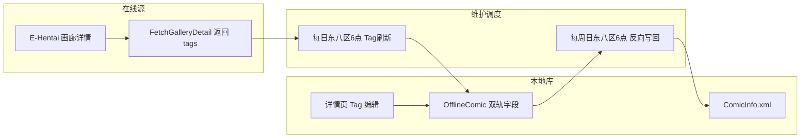

# 本地漫画 Tag 维护系统完整方案

> 目标：为本地离线漫画建立一套「在线 Tag 镜像 + 本地客制化」的双轨维护体系，含每日 Tag 刷新、每周反向写回 ComicInfo，以及可视化维护界面。
> 本文档用于敲定整体架构与分步实施计划，供实现阶段（Code 模式）执行。

---

## 一、总体数据流



### 双轨 Tag 三态模型

为每本离线漫画维护三类标签，回答「E 站镜像」与「本地客制化」的冲突：

| 字段                | 含义                                  | 来源             | 何时变化     | 是否写回 ComicInfo        |
| ------------------- | ------------------------------------- | ---------------- | ------------ | ------------------------- |
| `OnlineTags`        | E 站画廊的官方 tag（`namespace:key`） | 每日刷新抓取详情 | 每日刷新覆盖 | ✅ 写入                   |
| `OfflineAddTags`    | 用户本地新增的 tag                    | 用户编辑         | 仅用户手动   | ❌ 不写回（本地客制化）   |
| `OfflineRemoveTags` | 用户从 online 中删除的 tag            | 用户编辑         | 仅用户手动   | ❌ 不写回（且写回时剔除） |

**展示规则**：`展示 tags = (OnlineTags ∪ OfflineAddTags) − OfflineRemoveTags`

**刷新规则**：每日抓取到的新 `OnlineTags` 中，若某 tag 已被用户删除（在 `OfflineRemoveTags` 中），则该 tag 不恢复（"更新时略过"）。

**写回规则**：`ComicInfo.Tags = OnlineTags − OfflineRemoveTags`（不含 OfflineAddTags）

---

## 二、数据库结构设计

### 1. 模型扩展（[`models.go`](../backend/internal/models/models.go)）

在现有 `OfflineComic` 上新增三个字段（保持旧 `Tags` 字段做迁移兼容）：

```go
// ── Tag 双轨维护字段 ──
OnlineTags       string `gorm:"type:text" json:"onlineTags"`        // E站官方 tag JSON 数组
OfflineAddTags   string `gorm:"type:text" json:"offlineAddTags"`    // 本地新增 tag JSON 数组
OfflineRemoveTags string `gorm:"type:text" json:"offlineRemoveTags"` // 本地删除的 online tag JSON 数组

// 维护状态
LastTagRefreshAt int64 `json:"lastTagRefreshAt"`  // 上次 Tag 刷新时间戳(ms)
TagRefreshCount  int   `json:"tagRefreshCount"`  // 累计刷新次数
```

### 2. 迁移策略

- 现有 `Tags` 字段数据：首次启动/首次 Tag 刷新时，若 `OnlineTags` 为空而 `Tags` 非空，则将 `Tags` 内容迁移到 `OnlineTags`，随后 `Tags` 仅作为兼容字段保留（读取端不再优先使用）。
- 新模型加入 [`db.go`](../backend/internal/database/db.go) 的 `AutoMigrate` 列表（已包含 `OfflineComic`，仅需确认字段自动迁移）。

### 3. 维护设置模型（[`download.go`](../backend/internal/models/download.go) 仿照 `DownloadSetting` 单例）

新增 `TagMaintainSetting` 单例（ID=1）：

| 字段                                 | 默认 | 含义                                     |
| ------------------------------------ | ---- | ---------------------------------------- |
| `EnableDailyRefresh`                 | true | 开启每日 Tag 刷新                        |
| `EnableWeeklyWriteback`              | true | 开启每周反向写回                         |
| `RefreshHour`                        | 6    | 每日刷新小时（东八区，默认 6）           |
| `WritebackWeekday`                   | 0    | 写回日（0=周日）                         |
| `WritebackHour`                      | 6    | 写回小时（东八区，默认 6）               |
| `LastDailyRunAt` / `LastWeeklyRunAt` | 0    | 上次执行时间，用于界面展示与避免重复执行 |

---

## 三、后端服务与 API

### 1. 新服务 [`backend/internal/services/tag_maintain.go`](../backend/internal/services/tag_maintain.go)

核心逻辑（全部基于 `db *gorm.DB` 与 `ehService *EHService`）：

- **`RefreshAllTags()`**：遍历 `GID` 非空且 `NeedsUpdate=false` 的漫画 → `FetchGalleryDetail` → 合并计算新 `OnlineTags`（剔除 `OfflineRemoveTags` 中的项）→ 写库 → 统计「新增/删除/无变化」数量。
  - 复用 [`offline.go`](../backend/internal/services/offline.go) `CheckUpdates` 的遍历 + 限流退避（约 1.2s/本）模式。
  - 无 GID 的本地漫画跳过（无法关联 E 站）。
- **`WritebackComicInfo()`**：遍历全部 `OfflineComic` → 计算 `writeTags = OnlineTags − OfflineRemoveTags` → 更新 `ComicInfo.xml` 的 `Tags` 字段：
  - **散图文件夹**：直接改写 `ComicInfo.xml`。
  - **zip/cbz 归档**：需重打包（读原 zip → 替换/新增 `ComicInfo.xml` → 写临时文件 → rename）。若该路径失败则跳过并记日志。
- **`mergeTags(online, add, remove) []string`**：合并展示规则（供 API 返回前端展示）。
- **`nextDailyTime() / nextWeeklyTime()`**：计算东八区下一个 6:00 / 周日 6:00（复用 [`toplist.go`](../backend/internal/services/toplist.go) `StartScheduler` 的 `time.Sleep(time.Until(next))` 模式）。

### 2. 调度器 [`backend/internal/services/tag_scheduler.go`](../backend/internal/services/tag_scheduler.go)

- 启动方式：仿照 `ToplistService.StartScheduler` 与 `InitTagEngine`，在 [`router.go`](../backend/internal/router/router.go) `RegisterRoutes` 内创建并 `go` 启动。
- 用 `time.LoadLocation("Asia/Shanghai")` 固定东八区（Windows 可能缺 tzdata，需 `time.FixedZone("CST", 8*3600)` 兜底或引入 `_ "time/tzdata"`）。
- 循环内：读 `TagMaintainSetting` 判断开关；到点触发；执行完重算下一次时间。

### 3. 新增 API（注册于 [`router.go`](../backend/internal/router/router.go)）

| 方法 | 路径                      | 作用                                                           |
| ---- | ------------------------- | -------------------------------------------------------------- |
| GET  | `/offline/tags/setting`   | 获取维护设置                                                   |
| POST | `/offline/tags/setting`   | 保存维护设置                                                   |
| POST | `/offline/tags/refresh`   | 手动立即刷新全部 Tag                                           |
| POST | `/offline/tags/writeback` | 手动立即反向写回 ComicInfo                                     |
| GET  | `/offline/tags/progress`  | 刷新/写回进度（供界面轮询）                                    |
| PUT  | `/comics/:id/tags`        | 单本漫画 tag 编辑落库（body 传 `addTags` / `removeTags` 增量） |

对应 handler 放 [`handlers/offline.go`](../backend/internal/handlers/offline.go) 或新建 [`handlers/tag_maintain.go`](../backend/internal/handlers/tag_maintain.go)。

### 4. 详情接口改造（[`comic.go`](../backend/internal/handlers/comic.go)）

`GetOfflineComicDetail` 改用三态合并结果：`Tags = mergeTags(...)`（翻译仍走 `GlobalTagEngine.TranslateTags`）。同时保留 `onlineTags/offlineAddTags/offlineRemoveTags` 原始数组返回，供前端区分展示。

---

## 四、前端

### 1. 维护界面入口（已确认：设置新增栏目 + 离线侧边栏快捷入口）

**设置栏目新增「Tag 维护」栏目**，与「高级」平级（位于 [`SettingsView.vue`](../src/views/SettingsView.vue) menuItems 中，新建 [`src/components/settings/TagMaintainSettings.vue`](../src/components/settings/TagMaintainSettings.vue)）；同时在 [`OfflineSidebar.vue`](../src/components/OfflineSidebar.vue) 增加一个「Tag 维护」快捷入口（仿「维护」项，跳转 `/settings?tab=tag-maintain` 或独立路由，实现时定）。

页面内容：

- 开关：每日刷新 / 每周写回
- 时间展示：东八区 6:00 / 周日 6:00（固定或可配置）
- 按钮：「立即刷新 Tag」「立即写回 ComicInfo」两个手动触发按钮（放在本栏目界面内），带进度 banner（复用 [`OfflineUpdate.vue`](../src/views/offline/OfflineUpdate.vue) 的进度 UI 风格）
- 状态卡：上次刷新时间、上次写回时间、最近一次统计（新增/删除/跳过数量）

### 2. 详情页 Tag 编辑落库（[`OfflineDetail.vue`](../src/views/offline/OfflineDetail.vue)）

**核心修复**：当前 [`handleAddTag`](../src/views/offline/OfflineDetail.vue:148) 与 [`handleRemoveTag`](../src/views/offline/OfflineDetail.vue:165) 仅改内存数组、刷新即丢。改造为：

- `handleAddTag` → 调 `PUT /comics/:id/tags`（add）→ 落库到 `OfflineAddTags` → 本地数组更新
- `handleRemoveTag` → 判断 tag 属于 online 还是 offline_add：
  - 属于 online → 记入 `OfflineRemoveTags`
  - 属于 offline_add → 从 `OfflineAddTags` 移除
- UI 上可用不同颜色/角标区分「官方 Tag」与「本地 Tag」。

---

## 五、实施步骤

1. **后端模型**：扩展 `OfflineComic` 三态字段 + 新增 `TagMaintainSetting` 模型 + AutoMigrate。
2. **后端核心服务**：新建 `tag_maintain.go`（RefreshAllTags / WritebackComicInfo / mergeTags / 时区计算）。
3. **后端调度**：新建 `tag_scheduler.go`（东八区每日 6:00 刷新、周日 6:00 写回），在 `RegisterRoutes` 启动。
4. **后端 API + 路由**：维护设置 / 手动刷新 / 手动写回 / 进度 / 单本 tag 编辑；改造 `GetOfflineComicDetail`。
5. **前端设置栏目**：新建 `TagMaintainSettings.vue` + `SettingsView.vue` 注册 menuItems。
6. **前端详情页编辑**：`OfflineDetail.vue` tag 增删落库 + 官方/本地 tag 视觉区分。
7. **迁移兼容**：旧 `Tags` → `OnlineTags` 数据迁移。
8. **测试验收**：手动刷新、写回散图文件夹、归档跳过、时区计算、无 GID 跳过。

---

## 六、已确认决策

- **Q1 维护界面位置**：✅ 设置新增栏目「Tag 维护」；同时离线侧边栏加入口。
- **Q2 zip/cbz 归档写回**：✅ 支持重打包写回（读原 zip → 替换/新增 ComicInfo.xml → 临时文件 → rename）；失败则记日志跳过。
- **Q3 手动按钮**：✅ 提供「立即刷新 / 立即写回」按钮，置于新增栏目界面内。
