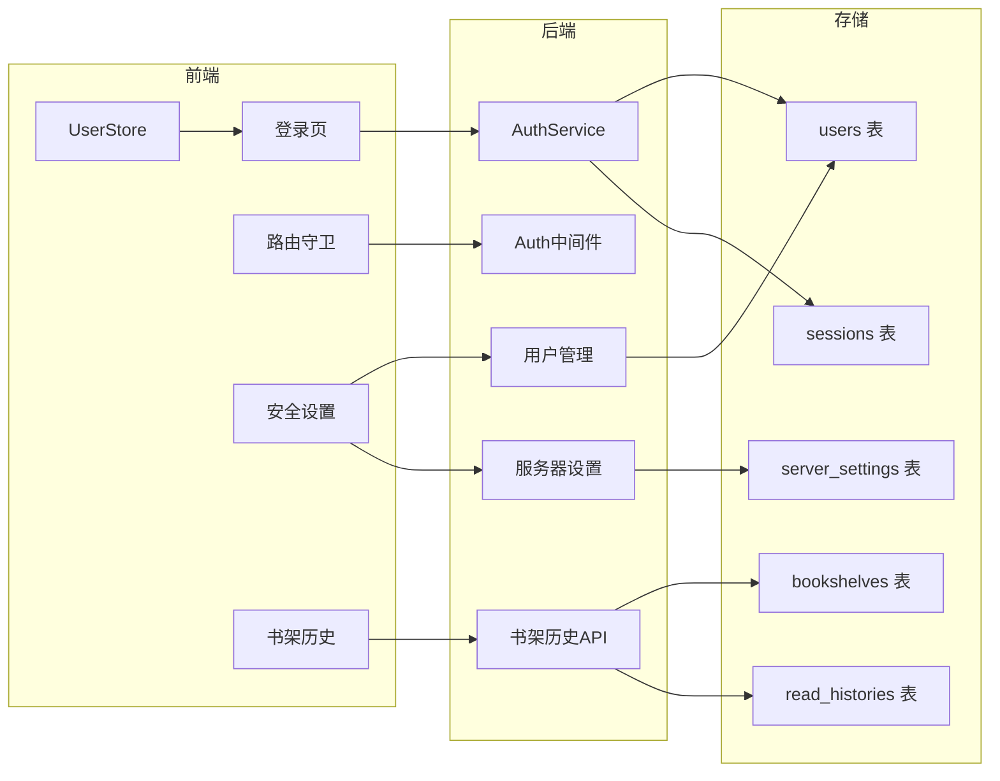
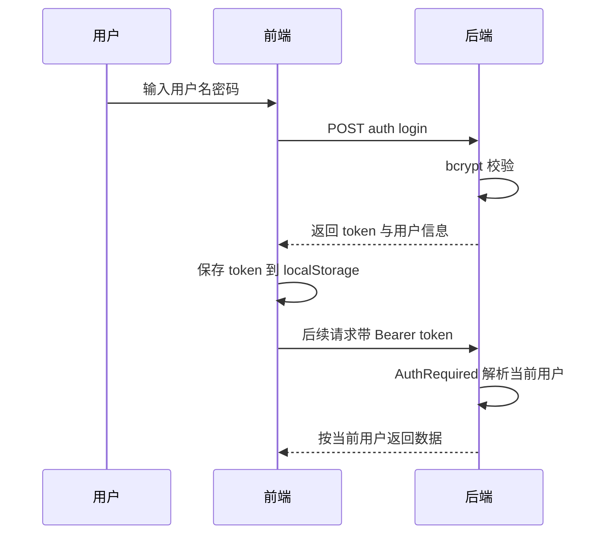

# 多用户管理 + 服务器端口配置 实施方案

## 一、背景与目标

当前应用是「单账号自用」形态：E 站凭证全局单例、书架与阅读历史全部存在浏览器 localStorage、无登录体系。本次改造目标是把它升级为可共享给家人/朋友的自托管服务器形态：

1. **去掉** 安全设置里的「开启密码认证」「开启生物认证」两个空开关。
2. **新增多用户管理系统**：
   - 在线部分区分开，每个用户只能使用**自己的 E 站账号**；
   - 下载许可由管理员配置，**默认关闭**；
   - 本地部分：非管理员只能阅读和创建自己的书架（书架各自用各自的）；
   - 管理员可以查看所有成员的阅读历史。
3. **新增服务器端口配置**：可设置监听 127.0.0.1 还是 0.0.0.0，并配置端口，为后续打包 release 铺垫。
4. 安全设置页面样式参考阅读设置布局（`section-title` 分区 + `setting-item` 条目）。
5. **补充开放的小功能**（同样分开管理）：手气不错、筛选、搜索、阅读清单、个人评分对普通用户开放；本地作品 Tags 仅管理员可修改。
6. **设置界面按角色过滤**：划分哪些栏目所有人可见、哪些仅管理员可见。

## 二、现状分析（关键约束）

| 现状                                                           | 位置                                                                                                                                   | 多用户后的影响                          |
| -------------------------------------------------------------- | -------------------------------------------------------------------------------------------------------------------------------------- | --------------------------------------- |
| E 站凭证全局单例 `AccountSetting`（ID=1）                      | [`backend/internal/models/account.go`](../backend/internal/models/account.go:6)                                                        | 需并入每个 User                         |
| 所有在线/下载 handler 用 `db.First(&account, 1)` 取全局账号    | [`backend/internal/handlers/online.go`](../backend/internal/handlers/online.go:44) 等多处                                              | 改为从当前登录用户取                    |
| service 方法大多显式接收 `account *models.AccountSetting` 参数 | [`backend/internal/services/eh_gallery.go`](../backend/internal/services/eh_gallery.go:17) 等                                          | 无需改签名，只需 handler 层喂入正确账号 |
| 书架、阅读历史存 localStorage                                  | [`src/stores/bookshelfStore.ts`](../src/stores/bookshelfStore.ts:17)、[`src/stores/historyStore.ts`](../src/stores/historyStore.ts:18) | 必须入库才能按用户隔离                  |
| 服务器监听硬编码 `0.0.0.0:8081`                                | [`backend/main.go`](../backend/main.go:49)                                                                                             | 改为读库配置                            |
| `go.mod` 已含 `golang.org/x/crypto`                            | [`backend/go.mod`](../backend/go.mod:45)                                                                                               | 可直接用 bcrypt，无需新依赖             |

## 三、总体设计（多用户管理方案核心）

本质：把「全局单账号」应用升级为「多账号 + 角色权限」的自托管服务。核心是四件事——**用户身份、认证会话、角色权限、数据归属**。

### 3.1 用户与认证

- 新增 `User` 表：`username`（唯一）、`password_hash`（bcrypt）、`role`（admin/member）、`allow_download`（默认 false）、E 站凭证字段（ipb_member_id / ipb_pass_hash / igneous / sk / is_ex）。
- 登录：`POST /auth/login` 校验 bcrypt → 生成随机 token（crypto/rand 32 字节）存入 `UserSession` 表 → 返回 token 与用户信息。
- 会话中间件 `AuthRequired`：解析 `Authorization: Bearer <token>` → 从 DB 加载 User → 注入 gin.Context；`AdminOnly` 在其上叠加角色校验。
- 无新外部依赖（bcrypt 用已有 x/crypto；token 用随机字符串 + DB 表）。
- **初始管理员**：启动时若 `users` 表为空，自动创建 `admin` 账号（默认密码 `admin123`）。**E 站凭证置空不迁移**，管理员登录后需自行重新绑定。初始账密在服务启动日志与控制台明确打印，并在登录页/安全设置给出提示，避免管理员登录不进去。

### 3.2 在线部分：每个用户自己的 E 站账号

- handler 层把「取全局账号」统一替换为「从 AuthRequired 注入的当前用户取凭证」。
- service 方法显式传 account 的**无需改动**，改动集中在 handler 层（见第九节文件清单）。
- `AccountSettings.vue` 改为「绑定当前登录用户自己的 E 站凭证」，弹窗与校验逻辑复用现有实现。
- 未绑定凭证的用户访问在线功能时返回提示「请先在账户设置中绑定自己的 E 站凭证」。
- **EH 站点偏好 / Profile 按用户隔离**：`EHSetting`（当前全局单例 ID=1）与 `EHProfile`（当前全局表）加 `user_id`，每个用户维护自己的一套站点配置与浏览预设；`EHSettings.vue` / `ProfileSettings.vue` 改为读写当前用户数据。
- **在线收藏状态按用户隔离**：`FavoriteState`（当前主键仅 GID）加 `user_id` 复合主键，不同 E 站账号对同一画廊的收藏状态互不干扰。

### 3.3 下载许可（默认关闭）

- `allowDownload` 字段控制。创建下载任务、恢复/重试任务、离线更新下载等写操作接口校验：`role == admin || allowDownload`，否则返回 403。
- 下载任务表新增 `user_id` 记录发起者；后台下载执行时用发起者账号（而非全局账号）。
- 管理员在安全设置「成员管理」中为成员开关下载许可。
- **核心权限思路**：系统级 / 共享数据的写操作（下载、离线更新、Tag 写回、用户管理、服务器配置）必须由管理员（或经管理员授予许可后）执行；成员自己的个人数据（书架、阅读历史、自己的 E 站凭证）仅本人可写，无需逐条审批。

### 3.4 本地部分：书架与历史按用户隔离

- 新增 `Bookshelf` 表（user_id + name + comic_ids JSON），书架 CRUD 按当前用户过滤，各用户书架互不可见。
- 新增 `ReadHistory` 表（user_id + comic_id + source + title/cover 快照 + read_at），阅读记录落库。
  - 普通成员：只能读写自己的历史。
  - 管理员：`GET /history/all` 可查看所有成员历史，历史页面提供「成员」筛选。
- 历史为持久化存储，配置**每用户历史记录上限**（`ServerSetting.historyLimit`，默认 200 条），超出时按 `read_at` 淘汰最旧记录；管理员可在安全设置调整。
- 本地漫画库本身保持全局共享（所有登录用户都可阅读），不按用户切分。

### 3.5 后台维护任务的账号

全局维护任务固定使用 **admin 账号**（管理员负责维护整个库）：

- Tag 每日刷新 / 每周写回 / 手动刷新 / 手动写回（手动操作加 `AdminOnly`）
- 离线更新检测 / 离线更新下载
- 榜单定时调度

> 原因：这些是"维护整库"的管理员职责。若 admin 未绑定凭证，维持现有「请先绑定 E 站账号」的错误提示逻辑。

### 3.6 服务器与存储配置

- 新增 `ServerSetting` 单例表（ID=1）：`bind_host`（默认 `0.0.0.0`，可选 `127.0.0.1` 或自定义）+ `port`（默认 8081）+ `history_limit`（每用户历史上限，默认 200）。
- `main.go` 启动时读取：`r.Run(fmt.Sprintf("%s:%d", host, port))`；DB 无记录则用默认值。
- API：`GET/POST /server/setting`（仅管理员可写），前端保存后提示「重启服务后生效」。

### 3.7 设置栏目可见性（按角色过滤）

`SettingsView.vue` 的 `menuItems` 按当前用户角色过滤：

| 可见范围 | 栏目                             | 说明                                                                                                 |
| -------- | -------------------------------- | ---------------------------------------------------------------------------------------------------- |
| 所有人   | 账户、EH、样式、阅读、偏好、关于 | 账户/EH/偏好（个人部分）为个人数据；样式/阅读为个人 UI 偏好；关于为纯展示                            |
| 仅管理员 | 网络、下载、Tag 维护、高级、安全 | 代理为系统级、下载路径/扫描为系统级、Tag 维护为全局、高级为日志/缓存/导入导出、安全含成员管理+服务器 |

- 「偏好」中的 **Tag 翻译 / 排序数据下载** 属系统级操作（写入本地 tag 引擎数据），入口移至仅管理员可见的「Tag 维护」栏目。
- 「账户」栏目：普通用户绑定**自己的** E 站凭证、修改自己密码；管理员另可在此管理成员。
- 「EH」栏目：每个用户维护**自己的**站点偏好与 Profile（多用户下 E 站偏好按用户隔离，与自己的 E 站凭证绑定）。

## 四、权限矩阵

| 能力                                     | 管理员 | 普通成员                |
| ---------------------------------------- | ------ | ----------------------- |
| 登录 / 修改自己密码                      | ✅     | ✅                      |
| 阅读本地漫画库                           | ✅     | ✅                      |
| 管理自己的书架                           | ✅     | ✅                      |
| 查看自己的阅读历史                       | ✅     | ✅                      |
| 在线浏览（自己的 E 站账号）              | ✅     | ✅                      |
| 绑定 / 更换自己的 E 站凭证               | ✅     | ✅                      |
| 下载 / 离线更新本地库                    | ✅     | ❌ 需下载许可（默认关） |
| 查看所有成员阅读历史                     | ✅     | ❌                      |
| 用户管理（增删改 / 重置密码 / 下载许可） | ✅     | ❌                      |
| 服务器端口配置                           | ✅     | ❌                      |
| 手气不错 / 筛选 / 搜索                   | ✅     | ✅（共享只读查询）      |
| 个人评分                                 | ✅     | ✅（按用户隔离）        |
| 阅读清单                                 | ✅     | ✅（按用户隔离）        |
| 本地作品 Tags 修改                       | ✅     | ❌                      |
| 维护自己的 E 站偏好 / Profile            | ✅     | ✅（按用户隔离）        |

## 五、数据模型（新增/修改）

```go
// 新增 users 表
type User struct {
    ID            uint   `gorm:"primaryKey"`
    Username      string `gorm:"uniqueIndex;not null"`
    PasswordHash  string `gorm:"not null"`
    Role          string `gorm:"default:'member'"` // admin | member
    AllowDownload bool   `gorm:"default:false"`
    // E 站凭证（并入，取代全局 AccountSetting）
    IPBMemberID   string
    IPBPassHash   string
    Igneous       string
    SK            string
    IsEx          bool
    CreatedAt     time.Time
    UpdatedAt     time.Time
}

// 新增 user_sessions 表（随机 token）
type UserSession struct {
    Token     string `gorm:"primaryKey"`
    UserID    uint
    CreatedAt time.Time
}

// 新增 bookshelves 表
type Bookshelf struct {
    ID        uint   `gorm:"primaryKey"`
    UserID    uint   `gorm:"index"`
    Name      string
    ComicIDs  string // JSON 数组
    CreatedAt time.Time
    UpdatedAt time.Time
}

// 新增 read_histories 表
type ReadHistory struct {
    ID       uint   `gorm:"primaryKey"`
    UserID   uint   `gorm:"index"`
    ComicID  string
    Source   string // online | offline
    Title    string
    CoverURL string
    ReadAt   time.Time
}

// 新增 server_settings 单例表
type ServerSetting struct {
    ID           uint   `gorm:"primaryKey;default:1"`
    BindHost     string `gorm:"default:'0.0.0.0'"`
    Port         int    `gorm:"default:8081"`
    HistoryLimit int    `gorm:"default:200"` // 每用户历史记录上限
}

// 修改 download_tasks：新增 UserID 字段
type DownloadTask struct {
    // ... 现有字段
    UserID uint `gorm:"index"`
}

// 新增 comic_ratings 表（个人评分，按用户隔离）
type ComicRating struct {
    UserID     uint      `gorm:"primaryKey"` // 复合主键之一
    ComicID    string    `gorm:"primaryKey"` // 复合主键之二
    Score      int       // 1-10
    UpdatedAt  time.Time
}

// 新增 reading_lists 表（阅读清单，每用户每来源一个队列）
type ReadingList struct {
    UserID     uint      `gorm:"primaryKey"` // 复合主键之一
    Source     string    `gorm:"primaryKey"` // online | offline（复合主键之二）
    Items      string    // JSON 数组（ComicItem 快照）
    UpdatedAt  time.Time
}

// 修改 eh_settings：加 UserID（每用户一套站点偏好，取代全局单例）
type EHSetting struct {
    // ... 现有字段（Site / PreferRedirect / SelectedProfile）
    UserID uint `gorm:"index"`
}

// 修改 eh_profiles：加 UserID（每用户自己的浏览预设档）
type EHProfile struct {
    // ... 现有字段（Name / Site / RowsPerPage / Resolution 等）
    UserID uint `gorm:"index"`
}

// 修改 favorite_states：加 UserID 复合主键（在线收藏状态按用户隔离）
type FavoriteState struct {
    UserID uint   `gorm:"primaryKey"` // 复合主键之一
    GID    string `gorm:"primaryKey"` // 复合主键之二
    // ... 现有字段（Token / FavCat / UpdatedAt）
}
```

## 六、数据迁移

1. **E 站凭证**：**置空不迁移**——创建 admin 时凭证为空，管理员登录后自行绑定；`AccountSetting` 表废弃不再使用。
2. **书架 / 历史**（来自 localStorage）：前端首次登录成功后，把浏览器本地已有的书架与历史一次性上传到该登录用户（迁移接口幂等：按 comicId 去重）。已登录用户后续数据直接走后端 API。
3. **EH 站点偏好 / Profile**：现有全局 `EHSetting` / `EHProfile` 数据迁移给 admin（admin 为默认管理员，直接继承当前生效配置）；普通用户新建时各自为空，登录后自行配置。

## 七、API 设计

```text
认证
POST /auth/login            用户名+密码 → { token, user }
POST /auth/logout           清除当前会话
GET  /auth/me               当前用户信息（含 role、allowDownload、isEx）

用户管理（管理员）
GET    /users               成员列表（不含密码）
POST   /users               新增成员（用户名/初始密码/角色/下载许可）
PUT    /users/:id           修改角色、下载许可
PUT    /users/:id/password  重置密码
DELETE /users/:id           删除成员（禁止删自己/admin）

书架（按当前用户隔离）
GET    /bookshelves
POST   /bookshelves
PUT    /bookshelves/:id
DELETE /bookshelves/:id

历史
GET    /history?source=offline         自己的历史
POST   /history                        记录阅读
DELETE /history?source=offline         清空自己的历史
GET    /history/all                    管理员：所有成员历史（可按 userId 过滤）

服务器
GET  /server/setting
POST /server/setting                   仅管理员

评分（按当前用户隔离）
GET    /comics/:id/rating              我的评分
PUT    /comics/:id/rating              { score } 保存/更新
DELETE /comics/:id/rating              清除评分

阅读清单（按当前用户隔离）
GET    /reading-list?source=online|offline
PUT    /reading-list?source=online|offline   整队列覆盖写入
DELETE /reading-list?source=online|offline   清空

本地 Tags（仅管理员）
PUT    /comics/:id/tags                 现有接口加 AdminOnly（本地 Tag 仅管理员可改）

改造（账号获取改为当前用户）
GET/POST /account/settings             绑定当前用户自己的 E 站凭证
```

## 八、前端改造

- 新增登录页 `LoginView.vue`（独立居中卡片），路由 `/login`；`App.vue` 在 `/login` 时隐藏侧边栏布局。**应用打开后首先进入 login 页**，输入账密登录成功后才进入 `/online/home`。
- 新增 `UserStore`：token、当前用户、login/logout/loadCurrentUser；`request.ts` 自动带 `Authorization: Bearer`，401 时清除 token 并跳登录。
- 路由守卫：未登录访问任意页面 → 重定向 `/login`。
- `securitySettings.ts` 删除两个字段；`SecuritySettings.vue` 按阅读设置布局重构：
  - 「👤 账户」：当前用户、角色徽标、修改密码
  - 「👥 成员管理」（仅管理员）：用户列表、新增成员、角色/下载许可开关、重置密码、删除
  - 「🖥️ 服务器」（仅管理员）：监听地址选择 + 端口输入，保存提示重启生效
- `AccountSettings.vue`：改为绑定当前登录用户的 E 站凭证。
- `bookshelfStore.ts` / `historyStore.ts` / `readingStore.ts` / 评分逻辑：由 localStorage 改为后端 API，全部按当前用户隔离；`OfflineHistory` 增加管理员专属「成员历史」入口。
- `SettingsView.vue`：`menuItems` 按角色过滤（见 3.7）；评分组件与阅读清单组件改为读写后端数据。
- `EHSettings.vue` / `ProfileSettings.vue`：改为读写当前登录用户的站点偏好 / Profile（按用户隔离）。
- Tag 翻译 / 排序数据下载入口：从 `PreferenceSettings.vue` **移除**，在 `TagMaintainSettings.vue` **新增**「Tag 数据同步」区块（复用现有 tag_engine 下载接口），仅管理员可见。
- `main.ts`：启动时初始化 UserStore（读取 token / 拉取当前用户）。

## 九、实施步骤

1. **后端地基**：User / UserSession / Bookshelf / ReadHistory / ServerSetting 模型 + AutoMigrate；AuthService（bcrypt + token + 中间件 AuthRequired/AdminOnly）；初始 admin 创建（凭证置空，日志打印初始账密）；main.go 读 ServerSetting 启动。
2. **认证 API**：login / logout / me + 用户管理 CRUD + 服务器设置 API + 路由注册。
3. **在线部分按用户隔离**：改造 handlers（online / offline / favorites / download / eh_setting / toplist / account / tag_maintain）账号获取为当前用户；`EHSetting` / `EHProfile` / `FavoriteState` 加 user_id 按用户隔离；下载任务加 user_id + 许可校验（默认关闭）；后台维护任务改用 admin 账号。
4. **书架 / 历史入库**：Bookshelf / ReadHistory CRUD API + 管理员全量历史接口；前端 store 改造 + 首次登录旧数据迁移。
5. **前端认证**：登录页 + 路由守卫 + UserStore + request.ts token/401 + App.vue 布局条件。
6. **补充功能入库**：ComicRating / ReadingList 模型 + 评分 / 阅读清单 API；`PUT /comics/:id/tags` 加 AdminOnly；前端评分 / 阅读清单 store 改后端 API。
7. **设置栏目过滤**：SettingsView.vue 菜单按角色过滤（账户/EH/样式/阅读/偏好/关于 → 所有人；网络/下载/Tag维护/高级/安全 → 仅管理员）；Tag 翻译 / 排序数据下载入口从 PreferenceSettings 移至 TagMaintainSettings（新增「Tag 数据同步」区块，复用现有下载接口）。
8. **安全设置 UI 重构**：SecuritySettings.vue（账户/成员管理/服务器，阅读设置布局）+ AccountSettings.vue 绑定当前用户 + 清理 securitySettings.ts。
9. **编译验证 + 测试验收**：后端 go build、前端 type-check、vite build。

## 十、已确认决策

1. **书架 / 历史入库**：认可迁入后端 DB。历史为持久化存储，需配置**每用户历史上限**（`ServerSetting.historyLimit`，默认 200）。
2. **认证会话**：随机 token 存 DB，重启服务后所有用户需重新登录。
3. **初始管理员**：首次启动自动创建 admin / admin123，**E 站凭证置空**（用户自行重新绑定）；初始账密在启动日志与界面明确提示，避免登录不进去。
4. **后台维护账号**：Tag 刷新/写回、离线更新检测等全局维护任务固定用 admin 账号。
5. **下载许可范围**：仅下载任务创建 / 恢复 / 离线更新下载等写库操作需要许可；在线浏览、阅读不算下载。核心思路：**系统级 / 共享数据写操作需管理员确认**，个人数据仅本人可写。
6. **登录界面**：应用打开先进入 login，登录成功后才进入 online/home。
7. **不开放注册**：无注册入口，由管理员登记用户（jellyfin 思路）。
8. **补充开放功能**：手气不错 / 筛选 / 搜索为共享只读查询，开放给所有用户；个人评分与阅读清单按用户隔离开放；本地作品 Tags 仅管理员可修改。
9. **设置栏目过滤**：账户/EH/样式/阅读/偏好/关于 → 所有人可见；网络/下载/Tag维护/高级/安全 → 仅管理员可见。
10. **E 站偏好 / 收藏隔离**：EHSetting / EHProfile / FavoriteState 均按 user_id 隔离；现有全局 EHSetting / EHProfile 迁移给 admin。

## 十一、流程图




