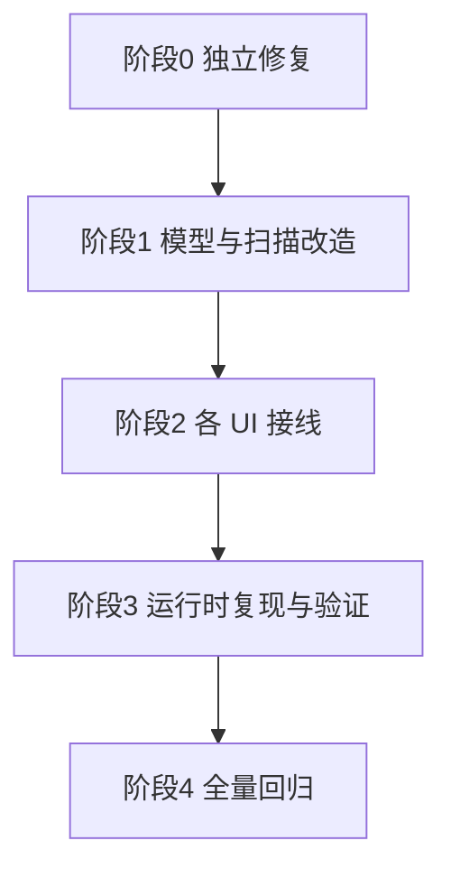

# SakuHentai 九大问题修复规划表

> 适用范围：Go 后端（Gin/GORM）+ Vue3 前端（Pinia/TS）
> 目标：一次规划、一条龙实现、逐项比对验收。
> 标记说明：✅ = 根因已确认；🔍 = 需运行时复现；🧭 = 定夺项（详见文末汇总表 D1–D13）

---

## 0. 总览

| #   | 问题                           | 结论                 | 主改层   | 关键文件                                                                                                                                                     |
| --- | ------------------------------ | -------------------- | -------- | ------------------------------------------------------------------------------------------------------------------------------------------------------------ |
| 1   | 离线首页按时间排序             | ✅ 缺字段+缺UI       | 前后端   | [models.go](backend/internal/models/models.go:1) / [OfflineHome.vue](src/views/offline/OfflineHome.vue:78)                                                   |
| 2   | 本地标题日语优先               | ✅ 元数据未解析      | 后端为主 | [metadata.go](backend/internal/services/metadata.go:1) / [scanner.go](backend/internal/services/scanner.go:327)                                              |
| 3   | 新增"来源"栏目                 | ✅ 无来源标记        | 前后端   | [scanner.go](backend/internal/services/scanner.go:239) / [comic.go](backend/internal/handlers/comic.go:45) / [ItemCard.vue](src/components/ItemCard.vue:121) |
| 4   | 离线更新/维护不可用+按路径开关 | ✅ 需接线+加开关     | 前后端   | [offline.go](backend/internal/services/offline.go:39) / [ExtraScanPathsSettings.vue](src/components/settings/ExtraScanPathsSettings.vue:1)                   |
| 5   | 阅读清单退出栈回退             | ✅ push 切本导致     | 前端     | [ComicReader.vue](src/views/ComicReader.vue:328)                                                                                                             |
| 6   | 随机抽卡未继承全局筛选         | ✅ 前后端各一处      | 前后端   | [RandomPicker.vue](src/components/RandomPicker.vue:104) / [random.go](backend/internal/handlers/random.go:113)                                               |
| 7   | 离线跳在线报错                 | 🔍 已定位3个真实缺陷 | 前端     | [RandomPicker.vue](src/components/RandomPicker.vue:141) / [useUI.ts](src/composables/useUI.ts:55)                                                            |
| 8   | 搜索栏输入特定内容消失         | 🔍 静态未定位        | 前端     | [SearchBar.vue](src/components/SearchBar.vue:50) / [TagChip.vue](src/components/TagChip.vue:39)                                                              |
| 9   | 阅读清单逻辑                   | ✅ 一行根因          | 前端     | [readingStore.ts](src/stores/readingStore.ts:59)                                                                                                             |

---

## 1. 逐问题方案

### 问题1：离线画廊首页新增按时间排序 ✅

**现状**

- [`OfflineHome.vue`](src/views/offline/OfflineHome.vue:78) 的 `filteredComics` 只有筛选管道，无排序。
- 后端 [`GetOfflineComics`](backend/internal/handlers/comic.go:46) 固定 `updated_at desc`。
- `UpdatedAt` 在扫描时写入 `time.Now()`，但 [`CheckUpdates`](backend/internal/services/offline.go:111) 打更新标记时也会改写 `UpdatedAt` → **不能当作稳定的"入库时间"**。
- `OfflineComic` 没有任何"发布时间 / 文件夹修改时间"字段。

**方案**

1. [`models.go`](backend/internal/models/models.go:1) 的 `OfflineComic` 新增三字段：
   - `AddedAt time.Time`（首次入库时间：`saveComic` 新建记录时写入，已存在不改）
   - `FileModifiedAt time.Time`（扫描时 `os.Stat(localPath).ModTime()`）
   - `PublishedAt *time.Time`（发布时间，D2 已定夺，见下）
2. [`scanner.go`](backend/internal/services/scanner.go:327) 的 `saveComic` 填充上述字段。
3. 前端：离线首页顶部加排序控件（D1 已定夺：SegmentedControl + 升/降序图标），对 `filteredComics` 做 `sort`（入库/修改/发布时间 × 升/降）。
4. [`comic.ts`](src/types/comic.ts:16) / [`comicStore.ts`](src/stores/comicStore.ts:44) 透传新字段（列表接口直接返回 model，后端无需改 DTO）。

**已定夺**

- **D1**：首页顶部 SegmentedControl（默认 / 入库 / 修改 / 发布时间）+ 升/降序图标。
- **D2（发布时间来源，优先级从高到低）**：
  1. 本地 `metadata` / `ametadata` JSON 的 `publishTime` 字段（JHentai 格式 `"2016-05-05 14:00"`，用户已确认存在）→ 需给 `EHMetadataJSON` 增加 `PublishTime` 字段并解析。
  2. ComicInfo.xml 的 `<Year><Month><Day>`（当无 JSON 时）。
  3. SakuHentai 自身新下载：`buildFullComicInfo` 写入的 metadata JSON 增加 `publishTime`，取在线详情 `Posted:` 值（[eh_detail.go](backend/internal/services/eh_detail.go:94) 已解析到 `updatedAt`）。

---

### 问题2：本地画廊显示标题优先日语 ✅

**现状**

- [`ParsedMetadata`](backend/internal/services/metadata.go:1) 无 `TitleJpn` 字段。
- `ParseDirMetadata` / `ParseZipMetadata` 只解析 Title/Category/Tags/GID/Token/ParentGID/FileCount/FileSize，**从不读 JSON 的 `title_jpn` 与 ComicInfo.xml 的 `<AlternateSeries>`**。
- [`saveComic`](backend/internal/services/scanner.go:253) 仅用 `meta.Title`。
- 用户举例：`<AlternateSeries>[Zutta] 魔法少女☆クライシス … Vol.2) [中国翻訳] [DL版]</AlternateSeries>` 即日文原名。

**方案**

1. `ParsedMetadata` 增加 `TitleJpn`；[`EHMetadataJSON`](backend/internal/services/metadata.go:183) 结构体**已含** `TitleJpn json:"title_jpn"`（[metadata.go](backend/internal/services/metadata.go:188)）→ 仅需在 `ParseDirMetadata`/`ParseZipMetadata` 中把 `jsonMeta.TitleJpn` 复制进 `ParsedMetadata.TitleJpn`。
2. ComicInfo.xml 读 `<AlternateSeries>` 作备选（[metadata.go](backend/internal/services/metadata.go:263) 的 ComicInfo 解析处，`xmlMeta.AlternateSeries` 已解析）。
3. `ParseZipMetadata`：同样从 JSON + ComicInfo.xml 读取（[metadata.go](backend/internal/services/metadata.go:308) 已读取相关文件）。
4. `OfflineComic` 增加 `TitleJpn`；`saveComic` 写入。
5. 展示策略见 D3（已定夺）。

**已定夺**：D3=双行显示（主标题=日语优先 TitleJpn，副标题=原标题）；D4=增量扫描时"路径已存在但 TitleJpn 为空 → 补填"。

---

### 问题3：新增"来源"栏目（额外路径 vs 下载导入）✅

**现状**

- 下载入库：`ScanAndSaveDirectory(destDir/extractDir)`（[download_gallery.go](backend/internal/services/download_gallery.go:199)、[download_archive.go](backend/internal/services/download_archive.go:177)），**无路径上下文**。
- 额外路径扫描：[scan_manager.go](backend/internal/services/scan_manager.go:54) → `scanDirectory(pathID,…)`，但 `saveComic` **不接收 pathID**。
- `ExtraScanPath` 无 `Name` 字段。

**方案**

1. `OfflineComic` 增加 `ScanPathID string`（空 = 下载导入）。
2. `saveComic` 增加 `scanPathID` 参数，`scanDirectory` 透传；`ScanAndSaveDirectory` 传空。
3. `ExtraScanPath` 增加 `Name string`（可配置显示名）；`AddScanPath`/`UpdateScanPath` 支持 Name（[scan_path.go](backend/internal/handlers/scan_path.go:22)）。
4. [`GetOfflineComics`](backend/internal/handlers/comic.go:45) 组装 DTO 时注入 `sourceLabel`：`ScanPathID` 非空 → 查路径 Name；为空 → `"下载"`。
5. 前端：`OfflineComic` 增加 `sourceLabel`；卡片角标 + 详情页展示（见 D6），`ExtraScanPathsSettings` 增加名称输入框。

**定夺项**：D5（旧数据回填）、D6（展示位置）

---

### 问题4：离线更新检测 / 本地维护查重 + 按路径开关 ✅

**现状**

- 路由**已注册**：[router.go](backend/internal/router/router.go:185) 的 `/offline/updates/*` 与 `/offline/maintain*`。
- 前端页面已存在：[OfflineUpdate.vue](src/views/offline/OfflineUpdate.vue:1)、[OfflineMaintain.vue](src/views/offline/OfflineMaintain.vue:1)。
- 后端逻辑已实现：[CheckUpdates](backend/internal/services/offline.go:39)、[MaintainDedup](backend/internal/services/offline.go:148)。
- 用户反馈"还没法用"，且需要**按额外路径开关**（额外路径可能来自其他 E 站实例）。

**方案**

1. **先验证"还没法用"的真实原因**（QA）：`CheckUpdates` 依赖已绑定 E 站账号（[offline.go](backend/internal/services/offline.go:44) 会报"请先绑定并保存 E 站账户凭证"）；1.2s/本 限流（[offline.go](backend/internal/services/offline.go:83)）+ 前端 20min 超时。需实际运行确认是"无入口 / 报错 / 超时 / 依赖账号"哪一种。
2. `ExtraScanPath` 增加 `EnableOfflineUpdate bool`；扫描时写 `ScanPathID`（复用问题3）。
3. `CheckUpdates` / `MaintainDedup` 增加范围过滤：仅处理"下载导入（ScanPathID 空）+ 已启用维护的路径"。
4. 前端：路径卡片增加"离线更新 / 维护查重"开关；OfflineUpdate / OfflineMaintain 页提示覆盖范围。

**定夺项**：D7（开关默认值）、D8（下载导入是否始终参与）、D9（查重是否跨路径）

---

### 问题5：阅读清单退出按钮栈回退 ✅

**现状**

- 退出按钮 `router.back()`（[ComicReader.vue](src/views/ComicReader.vue:798)）。
- 队列连贯阅读用 **`router.push`** 切下一本（[ComicReader.vue](src/views/ComicReader.vue:349)）→ 栈不断增长 → 退出时一本一本往回退。

**方案**

1. `handleNextInQueue` 改用 **`router.replace`** 切下一本 → 阅读器在栈上始终只有一帧，`back()` 直接回到进入阅读前的页面。
2. 保留退出按钮 `back()`；核查 [`ReadingList.vue`](src/components/ReadingList.vue:1) 进入阅读的入栈方式，保证单帧。

**定夺项**：D10（退出策略）

---

### 问题6：随机抽卡未继承全局筛选 ✅

**现状（两处）**

- 前端：[RandomPicker.vue](src/components/RandomPicker.vue:108) 明确跳过 offline 的 `categories`（`scopeType !== 'offline'`）。
- 后端：[random.go](backend/internal/handlers/random.go:113) 的 `randomOffline` 只有 keyword/minRating/minPages/maxPages，**无 category / language / onlyDownloaded**。

**方案**

1. 前端：去掉 offline 跳过条件；从 `offlineSearchConfig` 补传 `categories`（language / onlyDownloaded 见 D11）。
2. 后端 `randomOffline`：加 `category IN (activeCategories)`、`language:xx` tag 过滤、`is_downloaded = true`；`GetRandomComics` 扩展解析 `language`、`onlyDownloaded`（[random.go](backend/internal/handlers/random.go:87)）。

**定夺项**：D11（离线随机继承哪些条件）

---

### 问题7：从离线界面跳到在线画廊报错（"找不到该漫画" + 连锁报错）🔍

**排查结论**

- 已验证：在线随机项**携带 token**（[fromOnlineDTO](backend/internal/handlers/random.go:39) 透传 Token）→ "缺 token" 假设**不成立**。
- ✅ 已发现真实缺陷 A：`RandomPicker` 弹层 `<div @click="handleComicClick">`（[RandomPicker.vue](src/components/RandomPicker.vue:252)）包裹 `ItemCard`（根元素也有 `@click="handleCardClick"`，[ItemCard.vue](src/components/ItemCard.vue:121)）→ **一次点击触发两次导航**，栈被污染、可能引发时序错乱。
- ✅ 已发现真实缺陷 B：[ComicReader.vue](src/views/ComicReader.vue:188) 离线404弹窗分支 `await fetchOfflineComics()` **无 try/catch** → 若 reject 则 `router.back()` 永不执行，阅读器卡死在该错误态。
- ✅ 已发现真实缺陷 C：[useUI.ts](src/composables/useUI.ts:55) `openModal` 并发调用会**覆盖 `modalState.resolve`** → 第一个 Promise 永久 pending → 调用方永久挂起。非常契合"退出之后其他在线画廊也一直触发报错"（全局 modal 卡死/连锁）。
- 🔍 离线→在线的**确切报错链路**仍需运行时复现确认（候选 = 双击导航 × 全局 modal 并发覆盖 × 阅读器错误态卡死的组合）。

**方案**

1. 修复缺陷 A：`ItemCard` 加 `@click.stop` 或去掉外层 wrapper 的 `@click`，保留单一导航入口。
2. 修复缺陷 B：404 分支包 try/catch，保证 `router.back()` 一定执行。
3. 修复缺陷 C：`openModal` 并发时先 reject 上一个 pending（或改为队列），杜绝 Promise 泄漏/卡死。
4. 运行时复现：进入复现路径 + 采集 console.error，确认"找不到该漫画"确切来源。

**定夺项**：D12（复现/验证方式）

---

### 问题8：搜索栏输入特定内容消失 🔍

**排查结论（已更新用户新线索）**

- ✅ 已验证安全：后端 [`Suggest`](backend/internal/services/tag_engine.go:456) 对任意字符串无崩溃；[`OfflineHome`](src/views/offline/OfflineHome.vue:91) 过滤用 `toLowerCase().includes` 无正则崩溃；[`SearchBar`](src/components/SearchBar.vue:62) 联想请求失败有 try/catch。
- 🎯 **D13 第 1 问已答**：消失发生在**输入过程中（未回车）**、`#` 单独输入正常、键入第 2 个字符（形成 `3#`）时即触发 → 此阶段唯一发生重渲染的是**联想下拉**（`/tags/suggest` 返回后渲染 `TagChip` 与 `tag.count.toLocaleString()`）→ 判定**候选 a（联想渲染异常 → 组件树卸载白屏）为最大嫌疑**；候选 b/c（布局溢出、回车后目标页）基本排除。
- 🔍 剩余待复现：**仅搜索栏消失还是整页白屏？在线/离线模式是否都触发？**（D13 第 2/3 问）→ 复现时采集 console.error 确认抛错组件。

**方案（强化）**

1. 全局异常防护：`main.ts` 配 `app.config.errorHandler` + 错误边界组件，避免单点渲染错误导致整树卸载白屏。
2. [`TagChip.vue`](src/components/TagChip.vue:39) / 联想渲染防御：`count`/`name` 类型归一化、`toLocaleString` 前校验、限制联想条数；`SearchBar` 联想列表对异常 tag 条目做防御。
3. 运行时复现采集（F12 console），确认触发点后精准修复。

**定夺项**：D13（第 2/3 问待复现时确认）

---

### 问题9：阅读清单逻辑——非清单本读完不应继续排队 ✅

**根因（已确认）**
[`getNextComicInQueue`](src/stores/readingStore.ts:59) 中：

```ts
const currentIndex = list.findIndex((item) => item.id === currentId)
if (currentIndex === -1) {
  return list[0] // ← BUG：当前漫画不在清单时错误返回清单第一本
}
```

**方案**

1. `currentIndex === -1` 时 `return null`（一行修复）。
2. 复核边界：清单空 → null（已有）；当前在清单末尾 → null（已有）。
3. 补充注释说明语义。

**定夺项**：无（直接修复）

---

## 2. 定夺项汇总（D1–D14）

| #   | 问题 | 定夺项                   | 已定夺                                                                                                                         |
| --- | ---- | ------------------------ | ------------------------------------------------------------------------------------------------------------------------------ |
| D1  | 1    | 排序控件 UI 样式         | ✅ 首页顶部 SegmentedControl（默认/入库/修改/发布时间）+ 升/降序图标                                                           |
| D2  | 1    | 发布时间数据来源         | ✅ 优先本地 metadata JSON `publishTime`；次选 ComicInfo `<Year/Month/Day>`；SakuHentai 新下载写 `publishTime`（取在线 Posted） |
| D3  | 2    | 标题显示方式             | ✅ 双行：主标题=日语优先（TitleJpn），副标题=原标题                                                                            |
| D4  | 2    | 旧数据 TitleJpn 回填     | ✅ 增量扫描时"路径已存在但 TitleJpn 为空 → 补填"                                                                               |
| D5  | 3    | 旧数据来源回填           | ✅ 下次扫描（全量/增量）按路径补标 ScanPathID                                                                                  |
| D6  | 3    | 来源展示位置             | ✅ 卡片角标 + 详情页信息区，另可作为筛选条件                                                                                   |
| D7  | 4    | 维护开关默认值           | ✅ 新增路径默认「开」                                                                                                          |
| D8  | 4    | 下载导入是否始终参与维护 | ✅ 始终参与                                                                                                                    |
| D9  | 4    | 查重是否跨路径           | ✅ 同 GID/hash 全局查重；保留项优先下载导入/主路径                                                                             |
| D10 | 5    | 退出策略                 | ✅ replace 切本，back 直接回前置页                                                                                             |
| D11 | 6    | 离线随机继承哪些条件     | ✅ categories 必继承；language 可选；onlyDownloaded 忽略                                                                       |
| D12 | 7    | 复现/验证方式            | ✅ 先修已知缺陷（A/B/C）+ 运行时日志复现，两步走                                                                               |
| D13 | 8    | 复现信息三问             | 🔄 第 1 问已答（输入时即消失）；第 2/3 问复现时确认                                                                            |
| D14 | 新   | 多端适配（手机/平板/PC） | ✅ 拆出为独立任务，本次不实施（见第 6 节）                                                                                     |

---

## 3. 实施顺序与依赖



**阶段0（无依赖，先行）**

- 问题9：`getNextComicInQueue` 一行修复
- 问题6：随机抽卡前端传参 + 后端 `randomOffline` 过滤
- 问题5：`handleNextInQueue` 改 `replace` + 核查 ReadingList 入栈

**阶段1（共用模型改造，一次做完）**

- `OfflineComic` 新增：`TitleJpn`、`AddedAt`、`FileModifiedAt`、`PublishedAt`、`ScanPathID`
- `ExtraScanPath` 新增：`Name`、`EnableOfflineUpdate`
- `scanner.saveComic` 透传 `scanPathID` 并填充新字段；`metadata.go` 解析 TitleJpn
- `GetOfflineComics` 注入 `sourceLabel`
- 涉及：[models.go](backend/internal/models/models.go:1)、[metadata.go](backend/internal/services/metadata.go:1)、[scanner.go](backend/internal/services/scanner.go:239)、[scan_manager.go](backend/internal/services/scan_manager.go:54)、[comic.go](backend/internal/handlers/comic.go:45)、[scan_path.go](backend/internal/handlers/scan_path.go:22)

**阶段2（各 UI 接线）**

- 问题1：离线首页排序控件 + 类型透传
- 问题2：卡片/详情标题日语优先展示
- 问题3：来源角标 + 详情展示 + ExtraScanPathsSettings 名称输入
- 问题4：路径维护开关 + OfflineUpdate/OfflineMaintain 范围提示 + `offline.go` 过滤
- 涉及：[OfflineHome.vue](src/views/offline/OfflineHome.vue:78)、[ItemCard.vue](src/components/ItemCard.vue:1)、[OfflineDetail.vue](src/views/offline/OfflineDetail.vue:1)、[ExtraScanPathsSettings.vue](src/components/settings/ExtraScanPathsSettings.vue:1)、[scanPathStore.ts](src/stores/scanPathStore.ts:15)、[comic.ts](src/types/comic.ts:16)、[offline.go](backend/internal/services/offline.go:39)

**阶段3（问题7/8 运行时复现与验证）**

- 问题7：修复缺陷 A（双击导航）、B（404 分支 try/catch）、C（modal 并发覆盖）
- 问题8：全局 errorHandler + TagChip/联想渲染防御
- 复现策略（用户无法即时提供运行结果，已授权写 debug 脚本）：在 [`backend/cmd_debug/`](backend/cmd_debug/main.go:1) 下新增最小复现 main 包（沿用现有 `schemadump`/`statusdebug` 先例），一次性输出关键日志/状态（离线→在线导航链路、`/tags/suggest` 返回样例），自证根因后再精准收尾

**阶段4：全量回归 QA（见下）**

---

## 4. 验证清单（QA）

1. **问题1**：离线首页切换各排序项与升/降序，分页/筛选后排序保持正确。
2. **问题2**：含 ComicInfo.xml `AlternateSeries` 的画廊显示日语优先；JSON 含 `title_jpn` 的也正确；无日语数据的画廊回退原标题。
3. **问题3**：下载导入的画廊来源显示"下载"；额外路径扫描的画廊显示配置名；改名后列表同步。
4. **问题4**：未绑定 E 站账号时检测给出明确提示；绑定后检测可跑通；关闭某路径维护开关后，该路径漫画不再被检测/查重。
5. **问题5**：阅读清单连贯阅读多本后点退出，一步回到进入阅读前的页面（不逐本回退）。
6. **问题6**：离线随机抽卡继承分类等筛选；在线随机不受影响。
7. **问题7**：复现路径（离线界面随机抽到在线画廊→点击→阅读）不再报"找不到该漫画"；连续访问多个在线画廊无连锁报错。
8. **问题8**：输入"3#ARA大羅 REBOOT"及类似特殊字符，搜索栏与页面保持正常。
9. **问题9**：读清单外单本读完 → 无"继续下一本"提示；读清单内未本 → 正常提示下一本；读清单末本 → 提示"全部读完"。

---

## 5. 说明

- 问题7/8 的根因均含"需运行时复现"成分，规划中已列出已确认缺陷与候选路径；实现时先落地确定性修复与全局防护，再以日志复现收尾。
- 所有模型字段改动依赖 GORM AutoMigrate 自动加列；历史数据回填策略见 D4/D5。
- 问题8 已在"输入时即消失 + `#` 第二个字符触发"线索下锁定联想渲染为最大嫌疑，实现时优先落地全局错误防护 + 联想防御，再以日志复现收尾。

---

## 6. 多端适配（新增议题，D14 待定夺）

**现状盘点（已完成代码普查）**

- 全库仅 2 处 `@media`：`OfflineUpdate.vue`（720px）与 `OfflineMaintain.vue`（720px）。
- [`ComicReader.vue`](src/views/ComicReader.vue:360) 用 `window.innerWidth` 判断双页模式。
- [`StyleSettings.vue`](src/components/settings/StyleSettings.vue:118) 已有 桌面模式 / 移动模式 选项（viewMode 设置），目前仅影响有限布局。
- [`main.ts`](src/main.ts:15) 仅用 `matchMedia('(prefers-color-scheme: dark)')` 做暗色模式。

**结论**

现有响应式基础设施几乎为零。真正的多端适配是**横切全站 UI 的改造**（TopBar / Sidebar / GridContainer / ItemCard / 各视图 / 阅读器 / 设置页），与本次 9 个问题（多为数据、逻辑、后端及定点 UI）**耦合度低**。

**已定夺（D14）**：**拆出为独立任务**，本次 9 问题不实施多端适配。

- 理由：避免"AI 一条龙"批量改动过大导致回归面失控；用户睡眠后一次性逐项比对时，改动面越大越难定位问题归属。
- 后续单独开规划实施时，需先定移动端布局策略（抽屉式侧栏 / 卡片密度 / 阅读器手势）再排期。

---

## 7. 睡前准备与运行策略

**用户睡前建议做（一次性）**

1. **备份数据库**：退出应用后复制后端数据库文件（`backend/` 下 SQLite/DB 文件）到备份目录——本次含 AutoMigrate 加列与扫描改造，留底便于回滚。
2. **关闭"每次确认"**：本次实施需多次编译/运行后端（`go build`、debug 脚本）。若工具支持"自动批准/自动运行"，建议开启，否则人不在场无法逐次点击。
3. **电源设置**：笔记本请接通电源并设为"不休眠"，避免后端扫描/进程被系统挂起中断。
4. **保持本项目会话开启**：不要关闭 VS Code 会话，保证实施进程可继续执行。

**运行/验证策略（对应"每次调 Go 都要确认"与"无法即时给运行结果"）**

- 后端改动优先以**编译检查**（`go build ./...`）与**非交互 debug main**（[`backend/cmd_debug/`](backend/cmd_debug/main.go:1) 下新包）验证，减少对交互式终端的依赖。
- 问题7/8 运行时复现：以 debug 脚本 + 前端全局 errorHandler 日志落盘（`console.error` 写入文件）代替人工即时观察，实施完成后由用户逐项手测回归。
- 所有可自动化验证项先自动验证，仅 UI 交互项留待用户回归（见第 4 节 QA 清单）。
