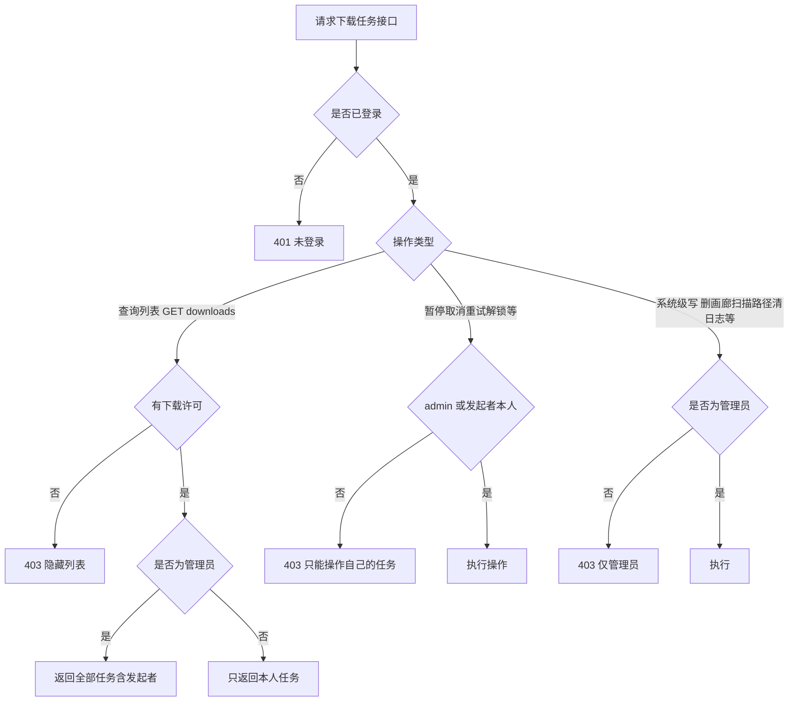

# 多用户权限完善实施方案

## 一、背景与目标

多用户系统已落地（登录 / 角色 / 下载许可 / 按用户隔离的书架、历史、评分等）。本次按「中心制」原则（**只有管理员可以修改数据库，普通用户只是读者**）补全权限漏洞：

1. **下载任务列表**：区分发起者——普通用户只能查看 / 操作自己发起的任务；管理员可查看并操作全部用户的任务。
2. **无下载许可用户**：直接隐藏下载列表（前端）+ 后端拒绝（403）。
3. **删除本地画廊**：改为仅管理员可操作。
4. **补充发现的越权问题**：扫描路径、日志清理、下载设置保存、任务恢复等系统级写接口补齐管理员校验。

## 二、已确认决策

- 管理员可查看并操作**全部用户**的下载任务（中心制兜底）；普通用户仅能看 / 操作**自己的**。
- 无下载许可（非 admin 且 `allowDownload=false`）用户：前端隐藏下载列表，后端 `GET /downloads` 返回 403。
- 任务操作归属校验：`admin || task.UserID == 当前用户.ID`，否则 403。
- 本次一并修复补充发现的系统级接口越权问题。

## 三、权限问题清单（现状 → 修改）

| # | 问题 | 位置 | 现状 | 修改 |
|---|------|------|------|------|
| A | 下载任务列表无归属/权限控制 | [`ListDownloads()`](backend/internal/handlers/download.go:118) → [`ListTasks()`](backend/internal/services/download.go:852) | 所有登录用户可见全部任务 | 无许可 403；非 admin 只查自己的；admin 查全部 |
| B | 任务操作无归属校验 | [`PauseDownload`](backend/internal/handlers/download.go:147)、[`CancelDownload`](backend/internal/handlers/download.go:170)、[`RetryDownload`](backend/internal/handlers/download.go:180)、[`UnlockDownload`](backend/internal/handlers/download.go:190)、[`GetDownload`](backend/internal/handlers/download.go:133) | 任意登录用户可操作他人任务 | 加归属校验 `admin \|\| task.UserID == user.ID` |
| C | 恢复/优先级仅校验许可、未校验归属 | [`ResumeDownload`](backend/internal/handlers/download.go:157)、[`SetDownloadPriority`](backend/internal/handlers/download.go:202) | 有下载许可即可操作他人任务 | 在许可校验基础上叠加归属校验 |
| D | 任务恢复全局越权 | [`RestoreDownloads`](backend/internal/handlers/download.go:222) → [`RestoreTasks()`](backend/internal/services/download.go:901) | 任意登录用户可恢复全部任务（触发他人任务重跑） | 移入 admin 分组 |
| E | 删除本地画廊无 admin 校验 | [`api.DELETE("/comics/:id")`](backend/internal/router/router.go:97) → [`DeleteOfflineComic()`](backend/internal/handlers/comic.go:277) | 任何登录用户可删除本地画廊/文件 | 移入 admin 分组 |
| F | 扫描路径 CRUD 无 admin 校验 | [`api` 组 scan-paths 路由](backend/internal/router/router.go:86) | 任何登录用户可增删改扫描路径、触发扫描 | 写操作（增/删/改/触发扫描）移入 admin；GET 保持登录可读 |
| G | 系统日志清理/设置无 admin 校验 | [`api.DELETE("/logs")`](backend/internal/router/router.go:116)、[`api.POST("/logs/settings")`](backend/internal/router/router.go:118)、[`api.DELETE("/client/log")`](backend/internal/router/router.go:110) | 任何登录用户可清系统日志 | 写操作移入 admin；日志上报 `POST /client/log`、读取类保持登录 |
| H | 下载设置保存无 admin 校验 | [`SaveDownloadSettings`](backend/internal/handlers/download.go:268) | 任何登录用户可改系统级下载配置 | POST 加 AdminOnly；GET 保持登录可读（下载流程可能读取默认方案） |

> 说明：`OfflineMaintain.vue` / `OfflineCompare.vue` 的删除走 `POST /offline/maintain/remove`，已在 admin 分组，无需改动；`OfflineUpdate.vue` 路由带 `requiresAdmin`，其内部删除按钮天然仅 admin 可见。

## 四、后端修改

### 4.1 下载任务归属校验与列表权限

**新增 handler 辅助函数**（[`backend/internal/handlers/download.go`](backend/internal/handlers/download.go)）：

```go
// requireTaskAccess 校验当前用户对任务可访问/可操作（admin 或发起者本人）
func requireTaskAccess(c *gin.Context, task *models.DownloadTask) bool {
    user := middleware.CurrentUser(c)
    if user == nil {
        c.JSON(http.StatusUnauthorized, gin.H{"error": "未登录"})
        return false
    }
    if user.Role != services.RoleAdmin && task.UserID != user.ID {
        c.JSON(http.StatusForbidden, gin.H{"error": "只能操作自己发起的下载任务"})
        return false
    }
    return true
}
```

**改造点：**

1. `ListDownloads`：
   - 无下载许可（非 admin 且 `!allowDownload`）→ `403 无下载权限，请联系管理员开启`（隐藏列表）。
   - 非 admin → 向 `ListTasks` 传入自己的 `user.ID`；admin → 不过滤。
   - `ListTasks(p DownloadListParams, userID uint)`：`userID > 0` 时追加 `q.Where("user_id = ?", userID)`。

2. 任务操作 handler 统一先取任务再校验归属：
   - `PauseDownload` / `CancelDownload` / `RetryDownload` / `UnlockDownload` / `GetDownload`：先 `manager.GetTask(id)` → `requireTaskAccess` → 再调对应 manager 方法。
   - `ResumeDownload` / `SetDownloadPriority`：先 `requireDownloadPermission`（现状），再 `GetTask` + `requireTaskAccess`。

3. **发起者用户名展示**（管理员视角区分任务归属）：
   - [`models.DownloadTask`](backend/internal/models/download.go:45) 加非持久化展示字段：`Username string \`gorm:"-" json:"username,omitempty"\``。
   - `ListTasks` 查询结果后，按 `UserID` 批量查 `users` 表填充 `Username`（普通用户只看自己的，该字段无实际作用；admin 用）。

4. `RestoreDownloads`（`POST /downloads/restore`）→ 从 `api` 组移入 `admin` 组（router.go）。

### 4.2 删除本地画廊需管理员

- [`backend/internal/router/router.go`](backend/internal/router/router.go)：将 `api.DELETE("/comics/:id", handlers.DeleteOfflineComic)` 从登录组移入 `admin` 分组（与 `admin.PUT("/comics/:id/tags", ...)` 同组）。

### 4.3 系统级写接口补齐 admin（router.go 调整）

| 路由 | 调整 |
|------|------|
| `POST /scan-paths`、`PUT /scan-paths/:id`、`DELETE /scan-paths/:id`、`POST /scan-paths/:id/scan` | 移入 admin 组（写操作） |
| `GET /scan-paths`、`GET /scan-paths/:id/scan/progress`、`GET /scan-paths/scan-progress` | 保持登录可读 |
| `DELETE /logs`、`POST /logs/settings` | 移入 admin 组 |
| `GET /logs/categories`、`GET /logs/query`、`GET /logs/tail`、`GET /logs/settings` | 保持登录可读（日志页前端已 adminOnly，读取不越权写库） |
| `DELETE /client/log` | 移入 admin 组（清前端错误日志） |
| `POST /client/log`（上报） | 保持登录 |
| `POST /downloads/settings` | handler 内加 `AdminOnly`（或移入 admin 组）；`GET` 保持 |

> 实现方式二选一：① 直接把路由从 `api` 块移动到 `admin` 块（推荐，声明式）；② 保持路由位置、在 handler 内用 `middleware.AdminOnly()` 或手动判角色（用于 GET/POST 同路径需分开权限的场景，如 downloads/settings）。注意 `POST /downloads/settings` 与 `GET /downloads/settings` 权限不同，需在 handler 内分别校验（GET 登录可读、POST admin）。

### 4.4 后端验证

```bash
cd backend && go build ./... && go test ./...
```

## 五、前端修改

### 5.1 下载列表页 [`DownloadsView.vue`](src/views/DownloadsView.vue)

- 引入 `useUserStore`，新增计算属性 `canDownload = userStore.isAdmin || userStore.user?.allowDownload`。
- `canDownload` 为 false 时：不发起 `fetchTasks` 轮询，模板显示「无下载权限，请联系管理员开启」占位，隐藏任务列表与筛选区。
- 管理员视角：任务卡片 meta 区展示 `发起者：{{ task.username }}`（仅 admin 显示）；操作按钮（暂停/恢复/取消/重试/解锁/优先级）对 admin 全部可用。
- 普通用户：后端已只返回自己的任务，操作按钮照常显示。

### 5.2 下载中角标轮询 [`downloadTasksStore.ts`](src/stores/downloadTasksStore.ts)

- `fetchActiveDownloads` / `subscribeActiveDownloads`：进入前判断 `useUserStore`，非 admin 且无下载许可时不轮询（`activeGids` 保持空），避免无意义请求与 403 告警。
- 普通有许可用户：后端已按用户过滤，角标只反映自己的任务（天然正确）。

### 5.3 删除画廊按钮按 admin 隐藏（非 admin 隐藏，离线维护类页面已限 admin 无需改）

| 文件 | 修改 |
|------|------|
| [`OfflineHome.vue`](src/views/offline/OfflineHome.vue) | 批量删除按钮（`🗑️ 删除`）加 `v-if="isAdmin"` |
| [`OfflineDetail.vue`](src/views/offline/OfflineDetail.vue) | 删除按钮（两处）加 `v-if="isAdmin"` |
| [`OfflineBookshelf.vue`](src/views/offline/OfflineBookshelf.vue) | 「删除选中作品」按钮加 `v-if="isAdmin"`（仅隐藏删除**本地画廊**；「删除书架」为个人数据，保留给所有用户） |

- 兜底：`comicStore.deleteOfflineComics` 可在调用前判断 admin，非 admin 直接提示并返回（防御后端已加、前端也拦）。

### 5.4 下载入口对无许可用户隐藏（建议，体验一致性）

- 在线详情 / 卡片 / [`BatchDownloadBar.vue`](src/components/BatchDownloadBar.vue) 的「下载」入口对无下载许可用户隐藏（后端创建接口已 403，前端隐藏避免反复报错）。
- 在线详情 GP 面板入口随下载入口一并隐藏。

### 5.5 前端验证

```bash
npm run type-check && npm run build
```

## 六、测试场景（手工验收）

1. **管理员**：`GET /downloads` 返回全部用户任务并带 `username`；可暂停/取消/改优先级任何任务。
2. **普通成员（有下载许可）**：`GET /downloads` 只返回自己的任务；对他人任务调用 pause/cancel/priority → 403；删除本地画廊 → 403 且按钮隐藏。
3. **普通成员（无下载许可）**：`GET /downloads` → 403；下载列表页显示「无下载权限」占位；在线下载入口隐藏。
4. **普通成员**：调用 `POST /scan-paths`、`DELETE /logs`、`POST /downloads/settings`、`POST /downloads/restore` → 403。
5. **管理员**：上述系统级接口正常；删除本地画廊正常。

## 七、提交规范

按 `.roo/rules/code.md`：验证通过后 `git add -A` + Conventional Commits 中文描述提交。建议按功能拆分为：

- `feat(backend): 下载任务按发起者隔离与管理员兜底管理`
- `feat(backend): 删除本地画廊与系统级写接口限制为管理员`
- `feat(frontend): 按角色隐藏下载列表/删除入口并展示任务发起者`

## 八、流程图


