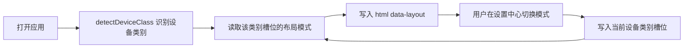

# 第二轮设备适配修复计划（真机反馈 + JHentai 借鉴）

## 一、真机反馈问题清单

| #   | 问题                                             | 触发场景             |
| --- | ------------------------------------------------ | -------------------- |
| P1  | 底部超大黑框                                     | 手机（移动界面）     |
| P2  | 组件挤作一团、显示不全                           | iPad 桌面布局 + 竖屏 |
| P3  | 底部黑条 + 顶部顶住屏幕 + 左右可拖动（横向溢出） | iPad 移动模式        |
| P4  | 上边栏文字太多（手气不错/筛选/搜索提示）         | 移动模式             |
| P5  | 排行榜不应显示领奖台                             | 移动端               |
| P6  | 搜索栏应随滚动显隐（ehentaiviewer 参考）         | 移动端（本轮做）     |

用户提议：采用 JHentai 思路，三态布局（auto/desktop/mobile）自行选择，且**按设备分开记忆**模式，避免各设备设置相互覆盖。

---

## 二、根因分析

### 2.1 断点错位 → P2（iPad 桌面布局竖屏挤）

`useLayoutMode` 与 App.vue 的移动断点是 `(max-width: 767px)`，但**所有 iPad 竖屏视口宽度 ≥ 768px**：

- iPad（第 9/10 代）：768px
- iPad mini：744px（<768，恰好正确）
- iPad Air / iPad Pro 11"：820 / 834px
- iPad Pro 12.9"：1024px；iPad Air 13"：1032px

iPad 竖屏时 `matchMedia('(max-width:767px)')` 不匹配 → auto 判为 **desktop** → 桌面侧栏常驻 + 桌面紧凑内容 → 挤作一团。这与 App.vue `--bp-tablet: 768px` 的设计注释（「<768 为平板/手机收进抽屉」）矛盾——**代码断点没兑现设计意图**。

### 2.2 移动形态与页面防溢出断点分裂 → P3（iPad 移动模式）

iPad 竖屏下若用户手动选「移动模式」：`data-layout='mobile'`（侧栏收进抽屉 ✓），但页面所有 `@media (max-width:767px)` 防溢出规则**不生效**（820 > 767）→ 页面仍是桌面紧凑形态：

- 详情页双列布局、GridContainer 3 列 → 太挤
- 固定宽度元素导致横向溢出（可左右拖动）
- 顶部未留安全区（`--safe-top` 在非刘海屏为 0）→ 内容顶到屏幕顶部
- 底部黑条 → 安全区未处理 + 背景透色

**结论**：`布局形态断点`（data-layout）与`页面防溢出断点`（@media）必须**统一**，否则 iPad 竖屏永远分裂。

### 2.3 底部超大黑框 → P1（手机移动界面）

`.main-content { overflow-y:auto }` 是独立滚动容器：

- **iOS Safari 橡皮筋回弹**：滚到底再上滑，容器内容被弹开，露出 `body` 深色背景（`--app-bg #121212`），形成大黑框。`overscroll-behavior-y:none` 只设在 `html/body`，未作用到滚动容器 `.main-content`
- **底部安全区未处理**：iPhone Home 条区域透出深色背景（黑条）
- `.main-content`/`.right-wrapper` 无明确背景色，透出 body 背景

### 2.4 布局模式全局单值 → 用户新需求（按设备记忆）

当前 `layoutMode` 存于 localStorage 单值。iOS 15+ Safari 会**跨设备 iCloud 同步 localStorage**，且用户可能多设备/多浏览器访问 → 一个设备的选择会覆盖另一设备。

**存储方案（简单可靠）**：不区分物理设备，只按**设备类别**（mobile/tablet/desktop）分组记忆。即使 localStorage 被 iCloud 同步，手机永远读 `mobile` 槽位、iPad 读 `tablet` 槽位，天然互不干扰。

---

## 三、方案设计

### 3.0 方案权衡：新增 tablet 布局 vs 调节断点阈值（用户决策）

用户提议四态：auto / desktop（PC）/ tablet（iPad）/ mobile（手机）。以下是两种路线的工作量对比与推荐。

**路线甲：新增 tablet 布局（四态）**

| 工作项                                                 | 难度               |
| ------------------------------------------------------ | ------------------ |
| LayoutMode 类型 + 设备槽位扩展                         | 小                 |
| useLayoutMode 支持 data-layout 三值 + 四模式解析       | 中                 |
| App.vue 定义 tablet 形态：侧栏形态、顶栏、汉堡逻辑     | 中（需先拍板形态） |
| 全页面 tablet 适配（10+ 页面各加一套 tablet 覆盖规则） | 大                 |
| GridContainer tablet 列数                              | 小                 |
| 测试矩阵（4 形态 × 多设备）                            | 大                 |

关键前置：**必须先把 tablet 形态定义清楚**。若 tablet ≈ mobile + 3 列，独立形态价值有限；若做窄图标栏 / 可拖拽双栏，则是 JHentai 结构性大改（原定二期范畴）。形态模糊会导致实施反复。

**路线乙：调节断点阈值（三态 + auto + 设备记忆）**

| 工作项                                                   | 难度       |
| -------------------------------------------------------- | ---------- |
| device.ts + styleSettings 按设备记忆                     | 中         |
| 断点 767→1024 全局替换                                   | 小（机械） |
| GridContainer：iPad 宽屏（≤1024）给 3 列，兼顾中间态观感 | 小         |
| App.vue 黑框/溢出修复                                    | 小         |
| TopBar 精简 + 排行榜去领奖台 + 搜索栏滚动                | 中         |

**推荐路线乙**：iPad 竖屏 auto 自动走移动形态（用户已验证「移动模式反而好一点」）；GridContainer 在 ≤1024 的 iPad 宽度给 3 列，弥补「专属中间态」观感；按设备记忆后 iPad 的选择可被记住；真正的 tablet 专属形态（窄栏/双栏）若确需，作为二期结构性升级再引入，届时可平滑扩展为四态（deviceClass 槽位已预留 tablet）。

---

### 3.1 按设备分类记忆布局模式（核心新能力）



**新增 `src/utils/device.ts`**：

```ts
export type DeviceClass = 'mobile' | 'tablet' | 'desktop'
export function detectDeviceClass(): DeviceClass {
  // iPad：UA 含 iPad，或 iOS13+ 桌面 UA(Macintosh) + 多点触控
  const isTablet =
    /iPad/.test(ua) ||
    (navigator.platform === 'MacIntel' && navigator.maxTouchPoints > 1) ||
    /Tablet/.test(ua)
  const isMobile = /Mobi|iPhone|Android/.test(ua)
  return isTablet ? 'tablet' : isMobile ? 'mobile' : 'desktop'
}
```

**改造 `src/stores/styleSettings.ts`**：

```ts
interface StyleSettings {
  themeMode: ThemeMode
  // 保留旧字段：作为「当前生效值」缓存，兼容旧数据迁移
  layoutMode: LayoutMode
  // 新增：按设备类别分组记忆
  layoutModeByDevice: Record<DeviceClass, LayoutMode>
}
```

读写逻辑：

- 初始化：`deviceClass = detectDeviceClass()`；旧数据只有 `layoutMode` 时，用其填充当前设备槽位（迁移）
- `getEffectiveMode()`：`layoutModeByDevice[deviceClass] ?? 'auto'`
- `setLayoutMode(m)`：写入 `layoutModeByDevice[deviceClass] = m`，同步 `layoutMode = m`

**StyleSettings.vue**：布局模式下拉旁显示「当前设备：📱手机 / 📱平板 / 💻桌面」，提示该选择只对此类设备生效；重置时清空整组 `layoutModeByDevice`。

`useLayoutMode` 的生效值改为 `styleSettings.getEffectiveMode()`（内部响应式）。

### 3.2 统一移动断点 → 767 → 1024px

**布局形态断点**：`useLayoutMode.ts` 的 `MOBILE_BREAKPOINT` 改为 `(max-width: 1024px)`。

**页面防溢出断点**：全局搜索替换所有 `@media (max-width: 767px)` → `(max-width: 1024px)`（App.vue / TopBar / 详情页 / 设置中心 / 下载页 / 两个排行榜 / RandomPicker 等）。

**GridContainer 断点重构**（`max-width` 档从 3 档合并为 2 档）：

- 原：≤1024 → 3 列；≤768 → 2 列；≤480 → compact 1 列
- 新：≤1024 → card 2 列；≤480 → compact 1 列（删除中间 3 列档，避免与统一断点冲突）
- `data-layout-force` 手动 desktop/mobile 覆盖逻辑保留

统一后效果：

- iPad 竖屏（≤1032，除 Air13 边缘）→ 移动形态 + 移动页面适配，不再挤/溢出
- iPad 横屏 >1024（1180/1194/1366）→ 桌面形态 + 4 列网格
- 手机（竖/横）→ 移动形态
- 桌面浏览器窄窗（<1024）→ 移动形态（合理）

App.vue `--bp-tablet` 注释同步更新。

### 3.3 底部黑框 / 黑条 / 横向溢出修复

**App.vue**：

- `.main-content`：`overscroll-behavior: contain;` + `background-color: var(--app-bg);`
- 移动形态 `.main-content`：`padding-bottom: calc(12px + var(--safe-bottom));`
- `html, body`：`overflow-x: hidden;`（兜底防横向拖动）
- `.right-wrapper` / `.app-container` 明确背景（避免透出 body 深色）

**横向溢出排查**（实施时验证）：断点统一 + GridContainer 2 列 + 详情单列堆叠后，主要溢出源应消除；若仍有残留，用 DevTools 定位 `scrollWidth > clientWidth` 的元素。

### 3.4 TopBar 移动端精简（P4）

- **RandomPicker**：「🎲 手气不错」→ 移动端只显示 🎲 图标（文字 `<span>` 在 `@media 1024` 隐藏）
- **FilterDrawer 触发按钮**：「⚙️ 筛选」→ 移动端只显示 ⚙️ 图标
- **ReadingList**：「📑 阅读清单」→ 移动端只显示 📑 图标 + 数字徽标
- **SearchBar placeholder**：移动端「搜索标题、作者或 Tag (支持中英文联想)...」→「搜索」

统一用 `@media (max-width: 1024px)` 控制。

### 3.5 排行榜移动端去领奖台（P5）

OnlineTop / OfflineToplist：

- CSS：`@media (max-width: 1024px)` 下 `.podium-section { display: none }`
- JS：引入 `useLayoutMode()` 的 `effectiveLayout`，当 `=== 'mobile'` 时 `restItems` 从 `slice(3)` 改为完整 25 名（`slice(0)`），前三名以普通卡片进列表；`section-subtitle` 移动端改为「TOP 25」

### 3.6 搜索栏随滚动显隐（P6，ehentaiviewer 参考）

- 监听 `.main-content` 的 `scroll`（App.vue 绑定），记录滚动方向：上滑（内容上移）→ TopBar `transform: translateY(-100%)` 隐藏；下滑 → 恢复显示
- 仅移动形态启用（`effectiveLayout === 'mobile'`），桌面常驻顶栏不动
- 需给 TopBar 加过渡动画（`transition: transform 0.25s`）
- **实现要点**：TopBar 目前在 `.right-wrapper` 内、`main-content` 外，滚动监听需在 App.vue 拿 `main-content` ref；若结构不便，可将滚动隐藏做成仅 `.main-content` 顶部悬浮

### 3.7 JHentai 借鉴评估（范围控制）

| JHentai 特性                            | 评估                                    | 本轮        |
| --------------------------------------- | --------------------------------------- | ----------- |
| 三态布局自行选择（auto/desktop/mobile） | 已有，增强为按设备记忆                  | ✅ 3.1      |
| 移动端精简顶栏交互                      | 部分已有，本轮图标化                    | ✅ 3.4      |
| 底部导航栏（home/download/setting）     | 结构性改动，移动端当前靠抽屉+顶栏已够用 | ⏸️ 二期候选 |
| 桌面窄图标侧栏 + 可拖拽双栏             | 结构性改动，当前 240px 侧栏已成熟       | ⏸️ 二期候选 |
| 平板双栏（左移动布局 + 右详情）         | 结构性改动                              | ⏸️ 二期候选 |

**结论**：本轮不照搬 JHentai 结构性布局（底部导航/双栏/窄图标栏），聚焦「三态 + 设备记忆 + 三 bug 修复 + 顶栏/排行榜精简」。避免大改破坏已有稳定交互。

---

## 四、实施步骤

1. 新增 `src/utils/device.ts`：`DeviceClass` + `detectDeviceClass()`（UA + maxTouchPoints 识别 iPad）
2. 改造 `src/stores/styleSettings.ts`：`layoutModeByDevice` 分组记忆 + 旧数据迁移 + `getEffectiveMode`/`setLayoutMode`
3. `useLayoutMode.ts`：生效值改用 `getEffectiveMode()`；断点 767→1024
4. `StyleSettings.vue`：显示当前设备类别与提示文案
5. 全局搜索替换 `@media (max-width: 767px)` → `(max-width: 1024px)`（App.vue / TopBar / 详情 / 设置 / 下载 / 排行榜 / RandomPicker 等）
6. `GridContainer.vue`：断点合并为 ≤1024 2 列 / ≤480 compact 1 列
7. `App.vue`：main-content `overscroll-behavior: contain` + 背景色 + 安全区 padding；`html,body` `overflow-x:hidden`；`--bp-tablet` 注释
8. TopBar 移动精简：RandomPicker / 筛选 / ReadingList 文字图标化；SearchBar placeholder 缩短
9. 排行榜去领奖台：podium 隐藏 + 移动端完整 TOP25
10. 搜索栏随滚动显隐：监听 main-content 滚动方向驱动 TopBar 隐藏/显示（仅移动形态启用）
11. `npm run type-check` + `npm run build`（205 模块）
12. 真机复验（手机 Safari / iPad 竖屏横屏 / 手动三态 + 设备记忆切换）

## 五、验证要点

- 手机：无底部大黑框；顶栏精简；排行榜无领奖台；横向无溢出
- iPad 竖屏（auto）：自动移动形态，侧栏收抽屉，页面单列不挤
- iPad 竖屏（手动移动）：无黑条、顶部不顶死、无左右拖动
- iPad 横屏（>1024）：桌面形态正常
- 设备记忆：手机选 mobile 后 iPad 不受影响（各自槽位独立）
- 桌面浏览器：正常 desktop，不受移动改动影响

## 六、风险与回退

- **断点 1024 是行为变化**：桌面浏览器窗口缩到 <1024 会切移动形态（响应式合理）；GridContainer iPad 横屏 3 列变 4 列（与桌面一致）。若不满可回退 GridContainer 加回 tablet 3 列档
- **设备检测依赖 UA**：iPad 桌面 UA（Macintosh + maxTouchPoints>1）已覆盖；异常时回退 desktop
- **旧数据迁移**：无 `layoutModeByDevice` 时用现有 `layoutMode` 填充当前设备槽位，保证老用户不丢设置
