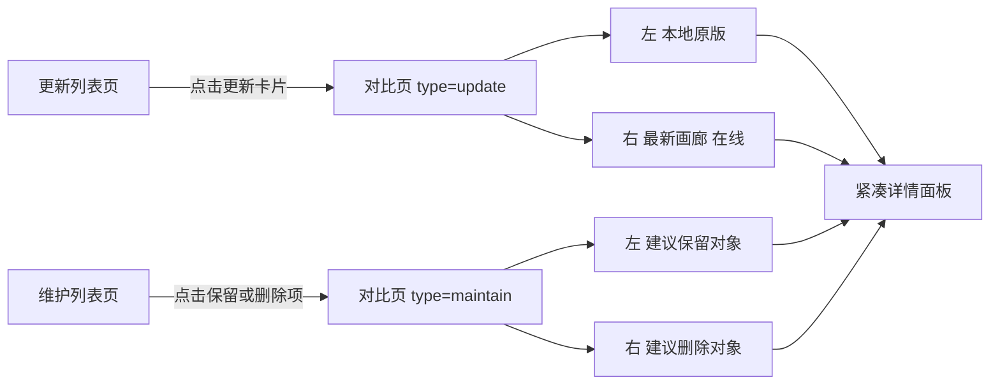
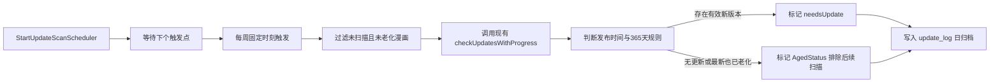
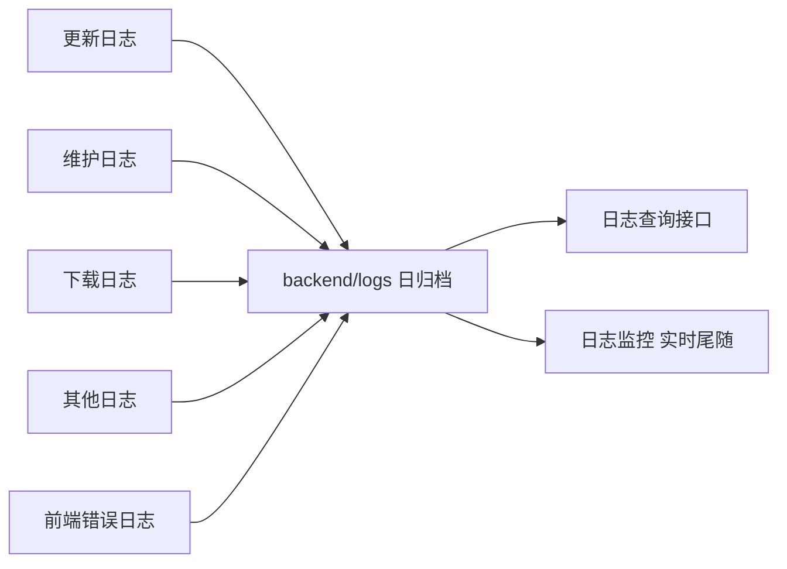

# SakuHentai 第四轮功能计划书（9 项）

> 面向：更新/维护/排行榜/日志/日期跳页等 9 项需求与 BUG 修复
> 配套文档：[`diagnostic-report.md`](plans/diagnostic-report.md)
> 已确认决策：日志存放于 `backend/logs/`；日期跳页同时应用于在线订阅页与离线首页；双列对比采用**新增独立路由页**。

---

## 一、总体架构

### 1.1 涉及技术栈

- 前端：Vue 3 `<script setup>`、Pinia 风格 Store、Vue Router（含全局滚动记忆钩子）、`useUI` 弹窗/Toast。
- 后端：Go + Gin、GORM、SQLite；异步任务 = 启动 goroutine + 前端 1s 轮询 `/progress` + 读取 `/result`。
- 滚动容器：全局主滚动容器为 `#main-content`（非 `window`），所有滚动跳转必须基于它。

### 1.2 双列对比路由结构

### 1.3 周扫描调度结构

### 1.4 四类日志系统结构

---

## 二、分项任务

---

### 任务一：双列对比视图

**需求**：桌面模式下点击「更新项」进入对比视图（左=本地原版，右=最新画廊）；点击「维护项」进入对比视图（左=建议保留，右=建议删除）；两个对比面板复用移动模式的小详情面板布局（参照 `OnlineDetailPanel`）。

**现状**：
- 更新卡片/维护项当前均不可点击，无对比视图。
- `OnlineDetailPanel` 内嵌 `OnlineDetail embedded`，是「在线」画廊详情面板；本地漫画没有等价的可复用紧凑面板（`OfflineDetail` 是整页视图，不可内嵌）。

**实施步骤**：

1. **后端：扩展维护结果 DTO，提供成对对象**
   - 修改 [`offline.go`](backend/internal/services/offline.go) 中 `DedupItemDTO` 的定义，新增 `pairComic`（对应对象）字段：
     - 规则 1 同 GID 重复：`keep=true` 项的 `pairComic` = 同 GID 的待删除项，反之亦然。
     - 规则 3 父子版本：保留对象（新版本）的 `pairComic` = 待删除旧版本，反之亦然。
   - `GET /offline/maintain/result` 返回时带上 `pairComic`。

2. **后端：提供单个离线漫画详情接口（若不存在）**
   - 确认现有 `GET /comics/:id` 已可供对比页拉取本地对象；若不足，补充返回 `newGID/newToken/publishedAt/localPath/fileSize` 等对比所需字段。

3. **前端：新增独立路由与视图**
   - 在 [`src/router/index.ts`](src/router/index.ts:9) 增加：
     - `/offline/compare`，`meta: { requiresAdmin: true }`，query 携带 `type=update|maintain` 与 `id=<comicId>`。
   - 新增 `src/views/offline/OfflineCompare.vue`：
     - 顶部返回按钮（回更新页或维护页）。
     - 桌面双列 grid（参照 `OnlineDetailPanel` 的 `.online-split` 布局）；移动端/强制移动形态改上下堆叠。
     - 左侧面板：新增紧凑组件 `src/components/OfflineDetailPanel.vue`（封面、标题、分类、页数、GID、发布/入库/修改时间、文件路径、大小、Tag chips，本地数据源）。
     - 右侧面板：
       - `type=update`：用 `newGID/newToken` 复用 `OnlineDetail embedded` 渲染最新画廊；接口不可用时展示 `updateNote` 文案回退。
       - `type=maintain`：用 `pairComic` 渲染建议删除对象（同左侧组件）。
     - 操作区：更新页对比提供「⬇️ 下载新版」；维护页对比提供「删除该对象」快捷入口。

4. **前端：入口接线**
   - [`OfflineUpdate.vue`](src/views/offline/OfflineUpdate.vue:196) 更新卡片整体可点击 → `router.push('/offline/compare?type=update&id=' + comicId)`。
   - [`OfflineMaintain.vue`](src/views/offline/OfflineMaintain.vue:270) 建议保留/建议删除项可点击 → `router.push('/offline/compare?type=maintain&id=' + comicId)`。

**验收**：桌面点击更新/维护项进入双列对比，右/左面板与移动详情面板风格一致；移动端上下堆叠；返回键回到原列表页。

---

### 任务二：幽灵文件 BUG 修复（维护/更新不一致）

**根因**（详见诊断报告 §1）：
- **A. 陈旧内存缓存**：`/offline/maintain/result` 返回的是内存全局变量 `offlineMaintainRes`（见 [`offline_task.go`](backend/internal/services/offline_task.go)），跨会话、跨设备共享且不随删除失效 → 平板展示的是旧扫描结果，点击已删除项 → `DeleteOfflineComic` 的 `db.First` 返回 `ErrRecordNotFound` → 「文件或记录不存在」。
- **B. 更新列表实为合法**：更新列表来自 DB（`WHERE needs_update=true`），该漫画是 `[たいらー] たんプリまんが`，其新版本 gid=4086937 **尚未下载到本地**，而维护规则 3 仅在「新版本已本地存在」时才把旧版列为建议删除，因此维护显示「暂无重复」、更新列表仍保留它 —— 这是**符合预期**的，并非数据残留。

**修复步骤**：

1. **让维护结果具备时效性与失效机制**
   - 在 `offline_task.go` 的结果缓存中新增 `FinishedAt`（时间戳）与 `RunID`。
   - 新增接口 `DELETE /offline/maintain/result`（或 `POST .../invalidate`）：在 `RemoveDedupComics` 成功后调用，把缓存标记为过期。
   - `GetMaintainResult` 对过期结果返回 `{ stale: true }`，前端据此提示「结果已过期，请重新扫描」。

2. **删除失败容错**
   - [`DeleteOfflineComic`](backend/internal/services/offline.go:641)：当 `db.First` 返回 `ErrRecordNotFound` 时，不再报「文件或记录不存在」而是返回 `{ alreadyDeleted: true }`，前端以「该记录已不存在，视为已删除」处理并刷新。

3. **前端刷新一致性**
   - [`OfflineMaintain.vue`](src/views/offline/OfflineMaintain.vue:253) `onMounted`：当读到 `stale` 或过期结果时，直接展示空态并提示用户点击「重新扫描」，避免复用陈旧缓存。
   - 维护执行删除成功后，顺带请求刷新更新列表（`/offline/updates`）或由导航守卫在进入更新页时强制 `fetchUpdates`，保证维护后更新列表即时一致。

4. **后端删除成功后同步清理缓存**
   - `RemoveDedupComics` 成功后：从 `offlineMaintainRes.items` 中剔除已删除 ID（即使缓存仍被读取也保持一致），并失效 `offlineUpdateRes`。

**验收**：平板/多端打开维护页不再出现旧结果；对已删除项点击删除给出「已不存在」而非报错；更新列表与维护结果在删除后即时一致；上述特定漫画在「新版本未下载」时仍出现在更新列表属正常行为，需在 UI 上以 `updateNote` 说明。

---

### 任务三：离线首页翻页回到顶部

**根因**：`handlePageChange` 使用 `window.scrollTo`，但真实滚动容器是 `#main-content`（见 [`scrollMemory.ts`](src/utils/scrollMemory.ts:31)），因此翻页后停留在底部。

**修复步骤**：

1. 在 [`OfflineHome.vue`](src/views/offline/OfflineHome.vue:222) 与 [`OfflineHistory.vue`](src/views/offline/OfflineHistory.vue:21) 的 `handlePageChange` 中，改用 `getMainContent()?.scrollTo({ top: 0, behavior: 'smooth' })`（回退 `window`）。
2. 建议抽一个共享工具 `scrollMainToTop()`（放入 `scrollMemory.ts`），`FloatingToolbar.handleScrollTop` 一并复用，避免三处重复逻辑。

**验收**：离线首页与历史记录翻页后自动回到顶部。

---

### 任务四：每周自动扫描 + Aged Status（365 天老化规则）

**需求**：仿照 Tag 维护的「写回日/写回时刻」，提供每周固定时刻自动更新扫描；并新增 Aged Status 状态位——按 E 站规则，发布超 365 天的画廊无法再通过 Gallery Manager Update 生成子画廊，此类画廊只扫描一次；若无更新（或更新后最新版也超 365 天），标记状态位并排除后续扫描。

**现状参照**：
- 调度模式：[`tag_scheduler.go`](backend/internal/services/tag_scheduler.go:1) `time.Sleep(time.Until(next))` + `tagMaintainLoc`（Asia/Shanghai）。
- 设置模式：[`models.go`](backend/internal/models/models.go:74) `TagMaintainSetting`（单例 ID=1）+ [`TagMaintainSettings.vue`](src/components/settings/TagMaintainSettings.vue:1)（写回日/写回时刻下拉与数字输入）。

**实施步骤**：

1. **后端：模型扩展**
   - [`models.go`](backend/internal/models/models.go:28) `OfflineComic` 新增：
     - `AgedStatus bool`（`agedStatus`，已老化/已完成老化判定，排除后续扫描）。
     - `AgedCheckedAt int64`（上次老化判定时间）。
   - 新增单例设置模型 `UpdateScanSetting`（ID=1）：
     - `EnableWeeklyScan bool`（默认 false）
     - `ScanWeekday int`（写回日，0=周日）
     - `ScanHour int`（写回时刻，东八区，默认 6）
     - `LastWeeklyScanAt int64`
   - 在 DB `AutoMigrate` 中注册新模型（见 [`database/db.go`](backend/internal/database/db.go)）。

2. **后端：调度器**
   - 新增 `backend/internal/services/update_scheduler.go`：`StartUpdateScanScheduler(db, ehService)`，仿 `tag_scheduler.go` 计算下一触发点（每周 `ScanWeekday` 的 `ScanHour`，东八区），到点调用「老化过滤 + 更新检测」。

3. **后端：老化过滤与单次扫描逻辑**
   - 扩展 [`filterOfflineUpdateEnabled`](backend/internal/services/offline.go:613)：追加条件 `aged_status = false`（已老化漫画不再参与）。
   - 新增 `ageCheckWithProgress(db, ehService)`：
     - 遍历 `publishedAt < now-365d` 且 `agedCheckedAt == 0` 的漫画（一次性）。
     - 走一次更新检测：若发现新版本，取最新画廊的发布时间——
       - 最新发布时间仍在 365 天内 → 正常标记 `needsUpdate`，不设 AgedStatus。
       - 无新版本，或最新也已超 365 天 → 设 `AgedStatus=true` 并写 `update_log`。
     - 更新 `AgedCheckedAt`，防止重复扫描。
   - 每周调度同时执行常规 `checkUpdatesWithProgress` 与老化判定。

4. **前端：设置 UI**
   - 在 [`SettingsView.vue`](src/views/SettingsView.vue:69) `allMenuItems` 新增 `{ id: 'update-scan', label: '更新扫描', icon: '🔄', adminOnly: true }`，对应新组件 `src/components/settings/UpdateScanSettings.vue`（仿 TagMaintainSettings：开关 + 写回日下拉 + 写回时刻 + 上次执行时间 + 手动立即扫描按钮 + 进度条）。
   - 新设置接口：`GET/PUT /offline/update-scan/setting`，手动触发复用现有 `/offline/updates/check`。

**验收**：设置页可配置每周自动扫描；老化漫画扫描一次后被标记并排除；设置页面显示上次自动扫描时间。

---

### 任务五：离线详情返回优化

**需求**：离线详情返回应「从哪里来回哪里去」，目前返回首页第一页底部。

**根因**（详见诊断报告 §4）：滚动记忆仅按 `path` 存 `scrollTop`，**未保存分页页码与列表状态**。用户在首页第 N 页进详情 → 返回后 `restoreScroll` 恢复的是第 N 页对应的 scrollTop，但 `currentPage` 已重置为 1 → 页面 1 内容更短 → 被浏览器钳制到「第一页底部」。

**实施步骤**：

1. **扩展滚动记忆为「列表状态」记忆**
   - [`scrollMemory.ts`](src/utils/scrollMemory.ts:20) 存储结构升级为 `{ top, page? }`（或新增 `rememberListState(path, { top, page })` / `takeListState(path)`）。
   - 路由守卫 [`router/index.ts`](src/router/index.ts:181) 的 `rememberScroll` 兼容旧格式。

2. **离线首页保存/恢复分页**
   - [`OfflineHome.vue`](src/views/offline/OfflineHome.vue:176)：`watch(currentPage)` + 离开页面时把 `{ top, page }` 写入列表记忆；返回后恢复 `page`，并在 `fetchOfflineComics` 数据就绪后再恢复 `scrollTop`（解决异步加载导致高度为 0、恢复失准）。
   - 书架页、历史页同样接入（若需要）。

3. **详情页返回**
   - [`OfflineDetail.vue`](src/views/offline/OfflineDetail.vue:1) `handleBack` 维持 `router.back()`；配合第 2 步即实现「从哪里来回哪里去」。
   - 阅读器返回详情链（detail→reader→back→detail）时，恢复详情页滚动位置（reader 关闭时 `rememberScroll('/offline/detail', ...)`）。

**验收**：从首页第 3 页进入详情 → 返回仍停留在第 3 页对应滚动位置；历史/书架页同样生效。

---

### 任务六：新增日志监控与查询（四类日归档）

**需求**：高级设置新增「日志监控」（实时终端日志）与「日志查询」；四类：更新/维护/下载/其他；按日归档为 `update_log-YYYY-MM-DD`、`maintain_log-YYYY-MM-DD`、`download_log-YYYY-MM-DD`、`other_log-YYYY-MM-DD`，存放于 `backend/logs/`。

**现状**：仅有前端错误日志 [`client_log.go`](backend/internal/handlers/client_log.go:30)（`logs/client.log`）。

**实施步骤**：

1. **后端：日志存储服务**
   - 新增 `backend/internal/services/log_store.go`：
     - 分类枚举 `update | maintain | download | other`。
     - `LogStore.Printf(category, format, args...)`：同时写 stdout 与 `backend/logs/<cat>_log-YYYY-MM-DD.log`（按本地日期切分），低侵入接入。
     - 启动时按需归档/清理过期文件。

2. **后端：现有日志点接入四类**
   - 把现有带标签的 `log.Printf` 分类化：`[update]`→update、`[maintain]`→maintain、`[download]`→download、其余（`[scan]`、`[sched]`、`[tagm]` 等）→other。

3. **后端：查询/监控/管理接口**（新增 `backend/internal/handlers/log.go`，挂载到 [`router/router.go`](backend/internal/router/router.go)）
   - `GET /logs/categories`：返回各类别、可用日期、文件大小。
   - `GET /logs/query?category=&date=&keyword=&offset=&limit=`：读文件、过滤、分页返回。
   - `GET /logs/tail?category=&since=`：返回 `since`（毫秒）之后的新行，供前端 1s 轮询做「实时监控」。
   - `DELETE /logs?category=&before=YYYY-MM-DD`：按类别 + 日期范围清理（供任务七使用）。

4. **前端：设置页新增「日志」入口**
   - [`SettingsView.vue`](src/views/SettingsView.vue:69) 新增 `{ id: 'logs', label: '日志', icon: '📜', adminOnly: true }`，对应 `src/components/settings/LogSettings.vue`，内含两个子 Tab：
     - **监控**：类目选择 + 实时滚动终端（复用轮询模式，1s 拉 `/logs/tail`），支持暂停/清屏。
     - **查询**：类目下拉 + 日期选择 + 关键词 + 分页表格/列表，展示每类文件大小。

**验收**：四类日志按日归档到 `backend/logs/`；监控页实时滚动显示后端日志；查询页可按类目/日期/关键词检索。

---

### 任务七：优化「开启日志 / 清除日志」

**需求**：「开启日志」含义不清、无用 → 改进；「清除日志」支持精细管理（选择清除多旧的日志）。

**现状**：
- [`AdvancedSettings.vue`](src/components/settings/AdvancedSettings.vue:4) 「开启日志」=`enableLogs`，仅门控前端错误上报。
- [`AdvancedSettings.vue`](src/components/settings/AdvancedSettings.vue:16) 「清除日志」= 一键 `DELETE /client/log` 全清。

**实施步骤**：

1. **「开启日志」重设计**
   - 拆分为两个语义清晰的开关：
     - 「启用系统日志」→ 控制四类操作日志落盘（接入任务六 `LogStore`）。
     - 「前端错误上报」→ 沿用 `enableLogs` 门控 `errorReporter`。
   - [`advancedSettings.ts`](src/stores/advancedSettings.ts:18) 扩展 `systemLogsEnabled` 字段并持久化；子文案说明各自作用。

2. **「清除日志」精细管理**
   - 点击后弹出管理弹窗（复用 `useUI` modal）：
     - 目标：全部 / 更新 / 维护 / 下载 / 其他 / 前端错误。
     - 范围：保留最近 N 天（7/30/90）或「清除全部」或「清除指定日期之前」。
   - 前端调 `DELETE /logs?...`（任务六接口），完成后刷新各分类大小。

**验收**：两个开关语义清晰；清除日志可指定类别与时间范围，不再一键全清。

---

### 任务八：优化日期跳页

**需求**：点击日期跳转弹出小提示框，两个 Tab：`选择节点`（昨天/三天前/一周前/两周前/一个月前/半年前/一年前/两年前）与 `选择日期`（指定日期），并带 `确定` 按钮立即跳转。

**现状**：日期跳转仅在线订阅页有，且是 `FloatingToolbar` 里一个裸 `<input type="date">`（需按 Enter），无预设节点、无确认按钮（见 [`FloatingToolbar.vue`](src/components/FloatingToolbar.vue:110) → `seekToDate`，[`subStore.ts`](src/stores/subStore.ts:145) / [`onlineStore.ts`](src/stores/onlineStore.ts:84)）。

**实施步骤**：

1. **新建通用日期跳转弹窗组件**
   - 新增 `src/components/DateJumpModal.vue`：
     - 两个 Tab：`选择节点`（8 个预设按钮，点击即填充日期）、`选择日期`（`<input type="date">`）。
     - `确定` 按钮 → `emit('confirm', dateStr)`；`取消` 关闭。
     - 复用 `useUI` modal 或独立 teleport 弹窗。

2. **在线订阅页接入**
   - [`FloatingToolbar.vue`](src/components/FloatingToolbar.vue:110) 的日期项改为按钮 → 打开 `DateJumpModal` → `seek-change` 事件 → [`OnlineSub.vue`](src/views/online/OnlineSub.vue:86) 现有 `seekToDate` 逻辑不变。

3. **离线首页接入（新）**
   - 为 [`OfflineHome.vue`](src/views/offline/OfflineHome.vue:1) 增加日期跳转入口（建议引入 `FloatingToolbar` 或分页栏旁按钮）。
   - 新增 `seekToDate(date)`：基于当前排序（`sortedComics`，默认 `publishedAt` 降序）找到首个 `sortKey <= date` 的项，计算其所在页并设置 `currentPage`，随后滚回顶部。

**验收**：订阅页与离线首页均可通过预设节点或指定日期一键跳到对应位置；离线首页跳到对应分页并回顶。

---

### 任务九：排行榜计数持久化

**根因**（详见诊断报告 §2）：`recordComicClick` 只改前端 store + localStorage，后端 DB `readCount` 从未递增；刷新 `fetchOfflineComics` 用 DB 值覆盖 → 归零。

**实施步骤**：

1. **后端：新增点击计数接口**
   - 新增 `POST /comics/:id/click`（handlers）：`db.Model(&OfflineComic{}).Where("id=?", id).UpdateColumn("read_count", gorm.Expr("read_count + 1"))`；幂等容错（不存在返回 404 不报错）。

2. **前端：记录即持久化**
   - [`comicStore.ts`](src/stores/comicStore.ts:113) `recordComicClick`：本地 +1 后 fire-and-forget `POST /comics/:id/click`（失败静默，不阻塞阅读）。
   - [`OfflineDetail.vue`](src/views/offline/OfflineDetail.vue:249) `handleStartReading` 已调 `recordComicClick`，无需改动入口。

3. **并发与刷新**
   - 多设备/多页面同时 `POST`，DB 原子 `+1` 安全；`fetchOfflineComics` 返回 DB 值即持久计数。

**验收**：点击进入阅读后排行榜计数增长；刷新页面/重启应用后计数不归零。

---

## 三、涉及文件清单

| 类别 | 文件 | 变更 |
|---|---|---|
| 路由 | `src/router/index.ts` | 新增 `/offline/compare` |
| 视图 | `src/views/offline/OfflineCompare.vue` | 新增 |
| 组件 | `src/components/OfflineDetailPanel.vue` | 新增 |
| 组件 | `src/components/DateJumpModal.vue` | 新增 |
| 组件 | `src/components/FloatingToolbar.vue` | 日期项改造 |
| 视图 | `src/views/offline/OfflineHome.vue` | 滚动/分页记忆/日期跳页 |
| 视图 | `src/views/offline/OfflineHistory.vue` | 滚动回顶 |
| 视图 | `src/views/offline/OfflineUpdate.vue` | 卡片可点击、刷新一致性 |
| 视图 | `src/views/offline/OfflineMaintain.vue` | 项可点击、过期结果处理 |
| 视图 | `src/views/offline/OfflineDetail.vue` | 返回位置（配合滚动记忆） |
| 工具 | `src/utils/scrollMemory.ts` | 列表状态记忆、scrollMainToTop |
| Store | `src/stores/comicStore.ts` | recordComicClick 持久化 |
| Store | `src/stores/advancedSettings.ts` | systemLogsEnabled |
| 设置 | `src/views/SettingsView.vue` | 新增「更新扫描」「日志」栏目 |
| 设置 | `src/components/settings/UpdateScanSettings.vue` | 新增 |
| 设置 | `src/components/settings/LogSettings.vue` | 新增（监控/查询） |
| 设置 | `src/components/settings/AdvancedSettings.vue` | 日志开关/清除重设计 |
| 模型 | `backend/internal/models/models.go` | AgedStatus、UpdateScanSetting |
| 服务 | `backend/internal/services/offline_task.go` | 结果时效/失效、pairComic |
| 服务 | `backend/internal/services/offline.go` | 删除容错、老化过滤 |
| 服务 | `backend/internal/services/update_scheduler.go` | 新增周扫描调度 |
| 服务 | `backend/internal/services/log_store.go` | 新增四类日志 |
| 处理 | `backend/internal/handlers/log.go` | 新增日志接口 |
| 处理 | `backend/internal/handlers/offline.go` | click、compare DTO、result 失效 |
| 路由 | `backend/internal/router/router.go` | 挂载新接口 |

---

## 四、建议实施顺序

1. **任务九（排行榜持久化）**：改动最小、独立，先行落地。
2. **任务三（翻页回顶）**：单点小修，顺带抽 `scrollMainToTop`。
3. **任务二（幽灵文件）**：后端缓存时效 + 删除容错 + 前端一致性，独立可验证。
4. **任务五（返回优化）**：滚动记忆升级为列表状态记忆，依赖任务三的工具抽离。
5. **任务六 + 任务七（日志系统）**：后端 `log_store` + 接口，再上前端监控/查询与开关/清除重设计。
6. **任务四（周扫描 + Aged Status）**：复用 Tag 维护调度模式，含设置 UI。
7. **任务八（日期跳页）**：通用弹窗 + 订阅页 + 离线首页。
8. **任务一（双列对比）**：依赖任务二的结果 DTO 扩展，最后做最大体量。

> 每项完成后按各自「验收」清单核对；后端改动需重启服务，前端改动由 Vite HMR 生效。
