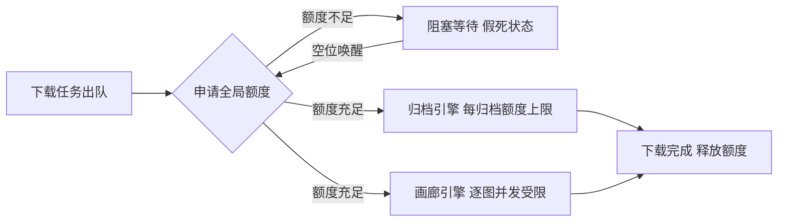

# SakuHentai 下载并发 Bug 诊断报告

> 针对用户提出的「4.1 单个文件被分配单个归档」与「4.3 超过 10 线程后 404（文件未被正常阻塞）」两份问题的诊断结论。
> 配套实施计划见 [`round5-four-optimizations-plan.md`](plans/round5-four-optimizations-plan.md)。
> 已确认修复方向：**方案 A 统一全局并发门控**（用户已拍板）。

---

## 1. 现象

- **4.3（文件未被正常阻塞）**：E-Hentai 最大线程数为 10，一旦同时进行中的请求超过 10 个，后续请求出现 404 报错。
- **4.1（单文件只用 1 个线程）**：无论单文件单独下载还是多文件并行，**每个文件均只有 1 个线程**（实测约 2mb/s），未用满开启的最大线程数（10 线程下期望 ≈20mb/s）；多文件之间也实际串行。用户怀疑根因是「同一优先级下同时下载所有画廊」。

两条现象实为**同一套并发控制缺陷的两个侧面**，详见第 3 节。

---

## 2. 关键代码现状

| 组件 | 文件 | 现状 |
|---|---|---|
| 任务队列 | [`download.go`](backend/internal/services/download.go:1) `DownloadManager` | 内存队列 `chan string`（容量 256）+ worker 池（16 个，仅兜底）+ SQLite 持久化；`Enqueue` 是非阻塞 select，队列满仅记日志（[`download.go`](backend/internal/services/download.go:429)） |
| 调度门控 | [`download_scheduler.go`](backend/internal/services/download_scheduler.go:1) | `DownloadAllGalleriesSamePriority=true` 时同优先级任务全部放行（`slotAvailable`）；注释明确「归档任务线程并发不在此门控，由 archive_thread_pool 统一管理」 |
| 归档线程配额池 | [`archive_thread_pool.go`](backend/internal/services/archive_thread_pool.go:1) | `defaultMaxArchiveThreads = 10`；`acquire` 为**全有或全无语义**：`active+n <= max` 才放行，否则 `sync.Cond.Wait()` 阻塞 |
| 画廊引擎 | [`download_gallery.go`](backend/internal/services/download_gallery.go:132) `downloadAll` | 用 `ConcurrentImageDownloads`（默认 10）作**信号量**并发逐图下载，**不经过线程配额池** |
| 归档引擎 | [`download_archive.go`](backend/internal/services/download_archive.go:926) `downloadArchiveFile` | 仅当 `ControlArchiveConcurrency=true` 才 `archivePool.acquire`；`resolveArchiveDownloadURL`（archiver.php 解锁，消耗 GP）发生在 acquire **之前** |
| 下载设置 | [`models/download.go`](backend/internal/models/download.go:1) | `ArchiveThreads`（默认 10）、`ControlArchiveConcurrency`（默认 true）、`DownloadAllGalleriesSamePriority`（默认 true）、`ConcurrentImageDownloads`（默认 10）。**无「最大归档并发数」字段** |
| 设置变更通知 | [`download.go`](backend/internal/services/download.go:753) `SaveSettings` | 仅在 `ArchiveThreads / ControlArchiveConcurrency` 变化时 `notifyArchiveThreadsChange`；**无优先级变化通知、无最大并发数变化通知** |

---

## 3. 根因证据链

### 3.1 4.3「超过 10 线程 404」——三条并发路径绕过/超出线程配额

**路径一：画廊引擎并发完全不受全局线程池约束（最主要根因）**

1. 画廊引擎 [`downloadAll`](backend/internal/services/download_gallery.go:132) 以 `setting.ConcurrentImageDownloads`（默认 10）为信号量，**每个画廊最多同时发起 10 个图片请求**。
2. 调度器 [`download_scheduler.go`](backend/internal/services/download_scheduler.go:1) 在 `DownloadAllGalleriesSamePriority=true`（默认）时，**同一优先级的所有画廊任务全部放行**（`slotAvailable` 对同优先级不设上限）。
3. 因此 N 个画廊并行下载时，总并发请求 = **N × 10**，远超 E 站线程上限 10 → 后续请求 404/限流。

> 该路径完全绕过 `archive_thread_pool`——画廊模式不是归档，走的是 `ConcurrentImageDownloads` 信号量，与线程配额池无关。

**路径二：归档解锁（archiver.php，消耗 GP）发生在 acquire 之前**

1. 归档引擎流程：`resolveArchiveDownloadURL`（请求 archiver.php 创建归档并拿 archiver_key，**消耗 GP**）→ [`downloadArchiveFile`](backend/internal/services/download_archive.go:926) → `archivePool.acquire`。
2. `archivePool.acquire` 只约束 **zip 分块下载阶段**，不解锁流程。
3. 因此多个归档任务可**同时走 archiver.php 解锁**（各自消耗 GP 后才排队），解锁请求数不受线程池门控 → 解锁阶段即可超限 404。

**路径三：`ControlArchiveConcurrency=false` 时完全无门控**

- 关闭开关后 `archivePool.acquire` 被跳过，归档分块下载也完全不受限。

### 3.2 4.1「单文件只有 1 个线程 / 多文件串行」——两个独立根因

> 用户澄清后拆分为两个独立现象：**单文件未用满线程** 与 **多文件串行**，根因不同，须分别修复。

**现象 A：单文件下载只有 1 个线程（速度 = 单线程，如 2mb/s），未用满 10 线程**

根因链（与线程池无关，是 **Range 探测失败 → 强制单线程**）：

1. 归档的多线程分块依赖服务器支持 HTTP Range：[`probeArchiveDownload`](backend/internal/services/archive_chunk.go:377) 发送 `Range: bytes=0-0` 探测。
2. 当前实测探测返回 **404**——[`download_archive.go`](backend/internal/services/download_archive.go:415) 分支注释将其解释为「H@H 下载页直链等不支持 Range 的服务器：带 Range 的请求返回 404」→ `rangeOK=false`。
3. 分块条件 `useChunk := rangeOK && total > 0 && threads > 1 && total >= minChunkSize*2`（[`download_archive.go`](backend/internal/services/download_archive.go:949)）因 `rangeOK=false` 不成立 → **强制走单线程 [`downloadZip`](backend/internal/services/download_archive.go:783)**。
4. 带 `start` 参数的 H@H 直链（[`resolveHathdlDownloadURL`](backend/internal/services/download_archive.go:546) 强制 `start=1`）也被 [`isHathStreamDownloadURL`](backend/internal/services/download_archive.go:514) 判定为流式 → 直接单线程。

> ⚠️ **关键反证（JHentai 实证）**：JHentai 用**同一套 `start=1` H@H 直链 + 多 Isolate Range 分片**成功实现单归档多线程下载（[`_getDownloadUrl`](JHentai/HathDownload/archive_download_service.dart:965) 强制 `start=1` + [`_generateDownloadTask`](JHentai/HathDownload/archive_download_service.dart:610) `isolateCount: archiveDownloadIsolateCount`），这是其每天运行的正常路径。因此「H@H 不支持 Range」**不是绝对结论**——我们探测 404 更可能是**探测方式差异**（JHentai 用轻量 `fetchContentLength` 探测，我们用 GET+`Range: bytes=0-0`）、**探测时机**或 **Referer/UA/头缺失**所致。
> **结论修正：现象 A 优先按「修复探测与分块路径」推进**（对照 JHentai 探测方式复现并修复，成功后单文件即可用满线程），而非认定 E 站限制；仅在修复后仍稳定复现 404 时才考虑服务端限制兜底（详见第 4 节）。

**现象 B：多文件下载串行（每个文件各 1 线程，总带宽 N×2 而非 10×2）**

1. 线程配额池 [`archive_thread_pool.go`](backend/internal/services/archive_thread_pool.go:48) `acquire` 为「全有或全无」：`active+n <= max` 才放行，否则阻塞。
2. 默认 `ArchiveThreads=10`、池 `max=10` → 第一个归档 `acquire(10)` 占满，其余全部阻塞在 `sync.Cond.Wait()`，直到第一个 `releaseAll`。
3. 结果：**任意时刻只有一个归档在下载**，无法利用「多文件并行 × 每文件线程」叠加总带宽。

> **结论：您怀疑的「同一优先级同时下载所有画廊」只是表象。** 调度器确实放行了同优先级任务，但真正卡死多归档并发的是线程配额池「全有或全无」语义。

### 3.3 与您「队列满假死」想法的差异

- 现有任务队列容量为 **256**，几乎不可能满；`Enqueue` 的 `default` 分支（队列满保持 queued）只是兜底，**不是**并发超限的触发点。
- 真正的并发超限发生在**引擎运行时**（画廊逐图、归档解锁/分块），此时任务已经消耗 GP / 爬取画廊。
- 因此「满则不提交下载申请（不耗 GP）→ 假死 → 空位唤醒」的**检查点应放在引擎开始耗 GP 之前**，即**统一全局并发门控**，而非队列满。

---

## 4. 修复方向（方案 A：统一全局并发门控）——已确认

将 [`archive_thread_pool.go`](backend/internal/services/archive_thread_pool.go:1) 升级为**全局下载并发额度池**，画廊与归档统一申请额度：

- 全局总线程上限 = `ArchiveThreads`（默认 10，即 E 站线程上限）。
- **归档**：额度不足则**阻塞在 acquire 之前**（`resolveArchiveDownloadURL` 之前）→ 不再提前消耗 GP；额度充足再解锁下载。
- **画廊**：接入同一额度池，逐图并发申请额度，总线程 ≤ 10，杜绝 N×10 超限。
- 新增 `MaxArchiveConcurrency`（最大归档并发数 1-10）控制同时运行的归档任务数，与额度池联动。
- 实现细节、优先级抢占、`MaxArchiveConcurrency` 分配规则见计划书「五、需求 4：下载体验优化」。

### 4.1 4.1「单文件未用满线程」：优先修复探测与分块路径（JHentai 实证可行）

现象 A（单文件只有 1 线程）**不依赖方案 A**，而是 Range 探测失败回退单线程所致。**JHentai 参考（[`JHentai/HathDownload`](JHentai/HathDownload/archive_download_service.dart:1)）证明：同一套 `start=1` H@H 直链 + HTTP Range 分片多线程下载在 E 站是可行路径**（[`_getDownloadUrl`](JHentai/HathDownload/archive_download_service.dart:965) + [`_generateDownloadTask`](JHentai/HathDownload/archive_download_service.dart:610) `isolateCount`）。因此修复优先方向是**对照 JHentai 探测方式复现并修复我们自己的探测/分块路径**，而非认定 E 站限制：

| 对照项 | JHentai 做法 | SakuHentai 现状（待修复） |
|---|---|---|
| 探测方式 | `JDownloadTask` 先 `fetchContentLength`（轻量探测拿总大小） | GET + `Range: bytes=0-0`（[`probeArchiveDownload`](backend/internal/services/archive_chunk.go:377)），404 即回退单线程 |
| 分片执行 | 多 Isolate 对同一 URL 分段 Range 并行下载 | `useChunk=false` 时整体回退单线程 [`downloadZip`](backend/internal/services/download_archive.go:783) |
| 直链判定 | 带 `start=1` 直链可直接多线程分片 | [`isHathStreamDownloadURL`](backend/internal/services/download_archive.go:514) 把带 start 判为流式单线程 |

**实施步骤**：先用真实账号触发一次归档下载，观察 `[ARCHIVER]` 日志探测码（206 vs 404）作为基线；随后**按 JHentai 方式改造探测与分块路径**（轻量探测 + 复核 Referer/UA/时机 + 重新评估带 start 直链判定）并复测。仅当修复后仍稳定复现 404 时，才考虑服务端限制兜底（改用 `MaxArchiveConcurrency` 多文件并行 + 画廊逐图多线程提升总吞吐）。

> 附带说明：**画廊逐图模式天然多线程**（`ConcurrentImageDownloads` 并发拉取不同图片），对「单本提速」若接受逐图消耗 Credits/GP，可改用画廊下载方案。

---

## 5. 影响面与回归风险

| 模块 | 影响 |
|---|---|
| [`archive_thread_pool.go`](backend/internal/services/archive_thread_pool.go:1) | 扩展为全局额度池，`acquire/release/adjust` 语义调整 |
| [`download_gallery.go`](backend/internal/services/download_gallery.go:132) | 信号量改为全局额度申请 |
| [`download_archive.go`](backend/internal/services/download_archive.go:926) | acquire 提前到解锁之前 |
| [`download.go`](backend/internal/services/download.go:1) | 队列/worker 语义调整、设置变更通知扩展 |
| [`download_scheduler.go`](backend/internal/services/download_scheduler.go:1) | 优先级抢占调度 |
| 现有测试 [`archive_download_test.go`](backend/internal/services/archive_download_test.go:1) | 需按新语义更新断言 |

---

## 6. 总结

- **真正的根因**：画廊引擎（N×10 信号量）与归档解锁（acquire 之前耗 GP）两条路径绕过全局线程门控；线程配额池「全有或全无」导致归档实际串行。
- **修复方向**：统一全局并发门控（方案 A），把「假死/唤醒」的检查点放在**引擎耗 GP 之前**，从根本上保证任意时刻对 E 站总并发 ≤ 10。
- **现象 A（单文件 1 线程）单独处理**：JHentai 实证 `start=1` H@H 直链 + Range 分片可行 → 优先**修复探测与分块路径**，而非认定 E 站限制（详见 4.1）。
- **附带收益**：配合 `MaxArchiveConcurrency` 与优先级抢占，一并解决 4.1 串行、4.2 并发控制、4.3 404 三个问题。
