# Round 7：四问题修复诊断报告与实施方案

> 涉及模块：阅读进度 / 历史记录 / 在线详情 / 返回导航 / 偏好设置
> 状态：待用户确认决策点后进入 Code 模式实施

---

## 一、问题 1：离线历史没有正确记忆上次阅读位置

### 根因（代码层面已全部确认，是多重缺陷叠加的时序竞争）

1. **卡片点击会销毁后端阅读进度**
   - [`ItemCard.vue:177`](../src/components/ItemCard.vue:177) 在打开详情**之前**调用 `addHistory(props.comic)`；
   - [`addHistory`](../src/stores/historyStore.ts:118) → [`syncHistory`](../src/stores/historyStore.ts:84) 以 `lastPageIndex: 0` 提交（`opts.lastPageIndex ?? 0`）；
   - 后端 [`AddHistory`](../backend/internal/handlers/library.go:334) 对已存在记录**无条件** `rec.LastPageIndex = req.LastPageIndex`，即：**任何一次卡片点击都会把后端阅读进度清零**。

2. **阅读器恢复优先级：后端进度覆盖本地**
   - [`ComicReader.vue:176`](../src/views/ComicReader.vue:176) 先取 localStorage `getSavedPage`，随后 `getHistoryProgress`（后端）在 `>0` 时**覆盖**本地值。

3. **快速退出丢后端 flush**
   - [`ComicReader.vue:922`](../src/views/ComicReader.vue:922) `onUnmounted` 清掉 1s debounce 的 `progressSyncTimer`；退出太快时后端没写成功（本地 `watch` 已同步写入）。

4. **组合效应**：本地写对了、后端要么被点卡清零、要么残留旧值。下次进入阅读器时「后端旧值覆盖本地新值」或「后端为 0 回退本地」，结果不确定 → 表现为 Case A 偶然正常、Case B/C 异常（本质是竞争条件）。

### 修复设计

- **A1（防清零）**：`addHistory` 的卡片点击不再破坏进度 ——
  - 前端：`addHistory` 里 `syncHistory` 不再传 `lastPageIndex: 0`（或改为可选入参，卡片点击默认不写进度）；
  - 后端：`AddHistory` 增加保护 —— 入参 `lastPageIndex <= 0` 且已有记录 `LastPageIndex > 0` 时**保留旧进度**（兜底，防其它调用方误清）。
- **A2（确定性恢复）**：详情页「立即阅读」改为**显式计算起始页并携带 `?page=N`** 跳转，不再依赖阅读器内部异步合并：
  - 抽取公共工具 `resolveResumePage(source, id, { fromHistory })`：先读 localStorage，再读后端进度（取非零者中的较大/较新值），无记录返回 `null`（= 第 1 页）。
  - 离线 [`OfflineDetail.vue:257`](../src/views/offline/OfflineDetail.vue:257) `handleStartReading` 与在线 [`OnlineDetail.vue:377`](../src/views/online/OnlineDetail.vue:377) `handleStartReading` 统一接入。
- **A3（退出落库）**：阅读器 `onUnmounted` 不再只是 `clearTimeout`，改为把待同步进度**立即 fire-and-forget** 提交后端（保证快速退出也不丢）。

---

## 二、问题 2：在线界面无法打开 —— 「画廊 ID 或 Token 参数缺失！」

### 根因（已确认）

- 历史项**丢失 token**：
  - 前端 [`toHistoryItem`](../src/stores/historyStore.ts:38) 映射 DTO → `ComicItem` 时**丢弃 token**（DTO 无该字段）；
  - 后端 [`HistoryRecord`](../backend/internal/models/models.go) 模型**无 token 列**，[`AddHistory`](../backend/internal/handlers/library.go:303) 不接收/不存储 token。
- 后端 [`GetOnlineComicDetail`](../backend/internal/handlers/online.go:324) 要求 `id` + `token` 同时存在。
- 从在线历史打开详情时 token = `onlineComic.value?.token || ''` = 空 → 前端 [`OnlineDetail.vue:152`](../src/views/online/OnlineDetail.vue:152) 直接报错。

### 修复设计

- **B1（持久化 token）**：
  - 后端 `HistoryRecord` 增加 `token` 列（DB 迁移），`AddHistory` / `GetHistory` 透传；
  - 前端 `HistoryRecordDTO`、`toHistoryItem` 携带 token。
- **B2（旧记录兜底）**：新增后端接口 `GET /comics/online/resolve-token?id=<gid>` —— 抓取 `E 站 /g/<gid>/` 页面从 missing-key 链接提取 token（标准 gid-only 解析法）；在线历史打开详情时若 token 为空，先调用该接口解析再跳转。
- **B3（入口透传）**：在线历史卡片点击（[`OnlineHistory.vue`](../src/views/online/OnlineHistory.vue)、`useDetailPanel` 窄屏分支）确保把解析后的 token 传入 `/online/detail?id=..&token=..`。

---

## 三、问题 3：偏好设置「是否从上次阅读位置开始」（默认关）

### 需求确认

- 新增偏好 `resumeFromLastPage`（**默认 false**）；
- **历史页入口**：无论偏好开关，始终从上次位置开始；
- **非历史入口**（首页/榜单/书架等）：偏好开 → 恢复；偏好关 → 第 1 页；
- **无阅读记录** → 第 1 页。

### 修复设计

- **C1**：[`preferenceSettings.ts`](../src/stores/preferenceSettings.ts) 接口新增 `resumeFromLastPage: boolean`，`defaultSettings` 置 `false`（store 自动持久化到 localStorage）。
- **C2**：[`PreferenceSettings.vue`](../src/components/settings/PreferenceSettings.vue) 按现有开关 UI 模式新增一项。
- **C3（接入恢复决策）**：`resolveResumePage` 增加策略入参：
  - `fromHistory` 为真 → 总是恢复；
  - 否则 `preferenceSettings.resumeFromLastPage` 为真才恢复；
  - 否则/无记录 → 第 1 页。
- **C4（历史入口标记）**：历史页打开详情时带 `?resume=1` 标记（离/在线历史导航统一处理），详情页据此判断「来自历史」。

---

## 四、问题 4：返回逻辑优化（含决策点，见下）

### 现状

- 新标签详情返回 = `isDetailNewTab` → `window.close()`；同标签 = `router.back()` / 首页兜底（[`OfflineDetail.vue:159`](../src/views/offline/OfflineDetail.vue:159) / [`OnlineDetail.vue`](../src/views/online/OnlineDetail.vue)）。
- 问题：原标签已关闭时，`window.close()` 可能连浏览器窗口一起关掉；且无法保证回到「来源列表的精确位置」。

### 修复设计（推荐方案）

- **D1（来源状态记录）**：扩展 [`detailNav.ts`](../src/utils/detailNav.ts)，在 `openComicDetailInNewTab` 打开新标签前，把「来源路由路径 + 滚动位置 + 页码」写入 sessionStorage（新增 `saku_back_<id>`，或扩展现有 `saku_newtab_<id>` 结构）。
- **D2（返回动作重写）**：详情页 `handleBack`：
  - opener 存在 → `window.close()`（标准多标签体验，opener 的位置由浏览器天然保留）；
  - opener 不存在（原标签已关）→ **不再裸 `window.close()`**，改为消费 `saku_back_<id>`，`router.replace` 到来源列表页并恢复滚动/页码；无记录则回该来源首页。
- **D3（补滚动记忆）**：目前仅离线 Home/History/Bookshelf 用了 `scrollMemory`；需为离线 Toplist 及在线各列表页补齐（离线 Toplist 完全没有；在线侧均未使用）。

---

## 五、执行清单（Code 模式）

```mermaid
flowchart TD
  A[问题1 阅读进度] --> A1[修 addHistory 防清零]
  A --> A2[详情页显式 ?page=N 恢复]
  A --> A3[阅读器退出 flush 后端]
  B[问题2 在线 token] --> B1[HistoryRecord 增 token 列]
  B --> B2[新增 resolve-token 接口]
  B --> B3[历史入口透传 token]
  C[问题3 偏好设置] --> C1[新增 resumeFromLastPage 默认关]
  C --> C2[PreferenceSettings 加开关]
  C --> C3[恢复策略接入偏好]
  C --> C4[历史入口 ?resume=1 标记]
  D[问题4 返回逻辑] --> D1[detailNav 记录来源状态]
  D --> D2[handleBack 无 opener 回来源列表]
  D --> D3[补全列表页滚动记忆]
  E[验证] --> E1[后端 go test]
  E --> E2[前端 type-check 与 build]
  E --> E3[git 提交]
```

---

## 六、需要用户决策的点（重点：问题 4）

1. **返回主行为**：opener 存在时，保持「关闭新标签返回 opener」（推荐，位置由浏览器天然保留）？还是希望改为同标签内导航？（会影响 `window.open` 还是 `router.push` 的整体入口策略）
2. **原标签已关闭的兜底**：推荐「回到来源列表页并恢复滚动/页码」；备选「仅回来源首页不恢复位置」（实现简单）。若选推荐，需确认是否接受为离线 Toplist 与在线列表页补齐滚动记忆。
3. **问题 2 token 解析**：是否接受新增后端「按 gid 解析 token」接口做旧记录兜底？备选「只对新历史记录持久化 token，旧记录失效不再处理」。
4. **问题 3「来自历史」判定**：推荐用 URL 标记 `?resume=1`（简单可靠、天然支持新标签）；备选用全局 store/路由状态。
